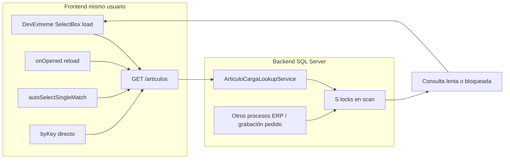

# Plan: concurrencia SQL Server, bucle de artículos y regla NOLOCK global

> **Ubicación versionada:** [`.cursor/plans/nolock-concurrencia-sql.plan.md`](./nolock-concurrencia-sql.plan.md) — incluir en Git junto al repo para compartir con el equipo. No duplicar en `docs/` salvo export puntual.

## Diagnóstico (qué está pasando)

Hay **dos problemas acoplados**, no uno solo:



### 1. Concurrencia y bloqueo (sí, es plausible)

En SQL Server, los `SELECT` con aislamiento por defecto (**READ COMMITTED**) toman **shared locks (S)** mientras escanean filas/páginas. No hace falta una transacción explícita en Laravel.

El lookup actual en [`backend/app/Services/PedidosWeb/ArticuloCargaLookupService.php`](backend/app/Services/PedidosWeb/ArticuloCargaLookupService.php) sigue siendo pesado aunque ya no tenga `OUTER APPLY`:

- `LIKE '%texto%'` sobre código + descripción (scan amplio).
- `WHERE NOT EXISTS` correlacionado contra la misma tabla `pq_pedidosweb_articulos` (autojoin por `base`).
- Dos `LEFT JOIN` a `pq_pedidosweb_stock` (artículo y base).
- `ORDER BY descripcion` + `TOP 500`.

Con **dos usuarios** (o un usuario + integración ERP actualizando stock/pedidos), las lecturas largas pueden **bloquearse mutuamente** o esperar locks de escritura (UPDATE/INSERT en `pq_pedidosweb_stock`, `pq_pedidosweb_pedidoscabecera`, etc.). Los índices ayudan al plan individual, pero **no eliminan el bloqueo** bajo concurrencia.

Escrituras que sí bloquean tablas (referencia):

- [`backend/app/Services/PedidosWeb/PedidoService.php`](backend/app/Services/PedidosWeb/PedidoService.php) — `DB::transaction` al grabar.
- [`backend/app/Repositories/PedidosWeb/PedidoRepository.php`](backend/app/Repositories/PedidosWeb/PedidoRepository.php) — `lockForUpdate()` puntual.

Hoy el repo **no usa `NOLOCK` ni `READ UNCOMMITTED` en ningún lado** (grep vacío).

### 2. Bucle de consultas (sí, persiste en frontend)

El fix `a87f2a2` deduplica solo el `load()` del `CustomStore` en [`frontend/src/features/pedidos/hooks/articulosCargaRemoteLoad.ts`](frontend/src/features/pedidos/hooks/articulosCargaRemoteLoad.ts), pero **no cubre todos los disparadores**:

| Origen | Archivo | ¿Pasa por dedupe? |
|--------|---------|-------------------|
| Búsqueda / desplegable | `loadArticulosCargaRemote` | Sí |
| `byKey` al resolver ítem | [`useArticulosCargaDataSource.ts`](frontend/src/features/pedidos/hooks/useArticulosCargaDataSource.ts) L88-91 | **No** — llama `searchArticulos` directo |
| Abrir desplegable vacío | `onOpened` → `reload()` | Disparo aparte |
| Auto-match único | [`tryAutoSelectSingleMatch.ts`](frontend/src/shared/ui/controls/tryAutoSelectSingleMatch.ts) | Puede llamar `dataSource.load()` si no hay ítems |

Si el backend **cuelga** (bloqueo o scan lento), DevExtreme mantiene `isLoading`, el usuario sigue interactuando y al liberarse o fallar aparecen **varias peticiones encadenadas**. Dos usuarios multiplican la carga sobre la misma BD compartida (`Ankas_del_sur`).

**Verificación previa recomendada (solo lectura en SQL Server):** durante la reproducción, consultar `sys.dm_tran_locks` / `sp_WhoIsActive` para ver si hay `LCK_M_S` / `LCK_M_IX` entre sesiones del portal y procesos ERP.

---

## Decisión: regla NOLOCK global (alcance elegido: todos los SELECT)

Pediste fuente de verdad para **todo SELECT Laravel sobre SQL Server**. La forma mantenible no es repetir `WITH (NOLOCK)` en cada `DB::table()` (Laravel no lo soporta nativo), sino:

### Regla documentada (contrato)

Crear regla Cursor + doc técnico:

- **Archivo regla:** [`.cursor/rules/sqlserver-read-uncommitted.mdc`](.cursor/rules/sqlserver-read-uncommitted.mdc)
- **Doc:** [`docs/backend/sql/sqlserver-lecturas-sin-bloqueo.md`](docs/backend/sql/sqlserver-lecturas-sin-bloqueo.md)

Contenido de la regla:

1. Conexión `sqlsrv`: sesión en **`READ UNCOMMITTED`** (equivalente semántico a `WITH (NOLOCK)` en todos los reads de esa sesión).
2. En SQL crudo / `DB::raw`, preferir hint explícito: `[tabla] AS [alias] WITH (NOLOCK)` para legibilidad en queries críticas.
3. **Prohibido** en: transacciones de escritura, `lockForUpdate()`, validaciones que requieran consistencia fuerte.
4. **Trade-off aceptado:** disponible/stock informativo puede leer datos sucios o no repetibles; coherente con listbox y consultas de solo lectura en BD ERP compartida.
5. **No aplica** a drivers distintos de `sqlsrv` (tests sqlite/mysql sin cambio).

### Implementación técnica

**A. Hook de conexión (cubre “todos los SELECT”)**

En [`backend/app/Providers/AppServiceProvider.php`](backend/app/Providers/AppServiceProvider.php) (o provider dedicado `SqlServerServiceProvider`):

```php
DB::connection('sqlsrv')->beforeExecuting(function ($query) {
    // Primera statement por request/conexión:
    // SET TRANSACTION ISOLATION LEVEL READ UNCOMMITTED;
});
```

Alternativa más limpia: evento `Illuminate\Database\Events\ConnectionEstablished` y ejecutar el `SET` una vez al obtener PDO de `sqlsrv`.

Condicionar por `config('database.default') === 'sqlsrv'` o por nombre de conexión tenant.

**B. Excepciones en escrituras (obligatorio con alcance global)**

Al abrir transacciones que modifican datos, **restaurar `READ COMMITTED`** al inicio del closure:

- [`PedidoService`](backend/app/Services/PedidosWeb/PedidoService.php)
- [`GridLayoutService`](backend/app/Services/GridLayout/GridLayoutService.php)
- [`PivotConfigService`](backend/app/Services/Pivots/PivotConfigService.php)
- Cualquier uso de `lockForUpdate()` en [`PedidoRepository`](backend/app/Repositories/PedidosWeb/PedidoRepository.php) / [`PedidosWebVisibilityGuard`](backend/app/Services/Visibility/PedidosWebVisibilityGuard.php)

Patrón:

```php
DB::transaction(function () {
    DB::statement('SET TRANSACTION ISOLATION LEVEL READ COMMITTED');
    // ... escritura ...
});
```

**C. Hints explícitos en SQL crudo (hot path + tests)**

Refactor menor en [`ArticuloCargaLookupService`](backend/app/Services/PedidosWeb/ArticuloCargaLookupService.php):

- `FROM [pq_pedidosweb_articulos] AS [a] WITH (NOLOCK)`
- joins `stock`, `listaprecios`, subquery `NOT EXISTS` también con `WITH (NOLOCK)`

Helper reutilizable sugerido: [`backend/app/Support/SqlServer/SqlServerReadHint.php`](backend/app/Support/SqlServer/SqlServerReadHint.php)

```php
public static function table(string $table, string $alias): string
{
    return "[{$table}] AS [{$alias}] WITH (NOLOCK)";
}
```

Actualizar test [`ArticuloCargaLookupServiceTest`](backend/tests/Unit/PedidosWeb/Services/ArticuloCargaLookupServiceTest.php) para assert `with (nolock)`.

---

## Endurecer bucle frontend (paralelo, bajo riesgo)

Cambios acotados en frontend:

1. **`byKey` usa el mismo loader deduplicado** que `load()` en [`useArticulosCargaDataSource.ts`](frontend/src/features/pedidos/hooks/useArticulosCargaDataSource.ts) — hoy es el bypass más claro.
2. **No llamar `reload()` en `onOpened` si ya hay `inflight`** para la misma lista (reutilizar `remoteLoadStateRef`).
3. **Auto-match:** si `isLoading`, no invocar `load()` adicional (ampliar [`tryAutoSelectSingleMatch.ts`](frontend/src/shared/ui/controls/tryAutoSelectSingleMatch.ts)).
4. Tests Vitest en [`articulosCargaRemoteLoad.test.ts`](frontend/src/features/pedidos/hooks/articulosCargaRemoteLoad.test.ts) + caso `byKey`.

Esto reduce peticiones **por usuario**; no reemplaza NOLOCK pero evita el “death spiral” cuando el backend tarda.

---

## Optimización SQL (mediano plazo, después de NOLOCK)

Índices ayudaron; para concurrencia + latencia conviene atacar el plan de ejecución:

| Problema | Dirección |
|----------|-----------|
| `NOT EXISTS` por `base` | Precalcular flag `es_base_carga` o vista/index filtrado; o reescribir con `LEFT JOIN` a conjunto pre-agregado |
| `LIKE '%q%'` | Mínimo 4 chars ya existe; evaluar full-text o prefijo `q%` si negocio lo permite |
| Restaurar `comprometido_web` | Solo con patrón agregado de [`StockConsultaService`](backend/app/Services/PedidosWeb/StockConsultaService.php) (`GROUP BY` + `LEFT JOIN`), nunca `OUTER APPLY` correlacionado |

---

## Orden de implementación sugerido

1. **Confirmar deploy** del PR #9 (`721c23d`) en producción — sin eso, puede seguir corriendo SQL con `OUTER APPLY`.
2. **Regla + doc NOLOCK/READ UNCOMMITTED** (fuente de verdad).
3. **Hook conexión sqlsrv** + excepciones en transacciones de escritura.
4. **Hints explícitos** en `ArticuloCargaLookupService` + test.
5. **Frontend dedupe `byKey`** y guardas anti-reload.
6. **Validación en tenant:** 2 usuarios buscando artículos; monitorear locks y Network (1 petición por término por usuario).
7. (Opcional posterior) Refactor `NOT EXISTS` y reintroducir `comprometido_web` con SQL agregado.

---

## Riesgos a comunicar al equipo

- **Lecturas sucias:** stock/disponible en listbox puede no coincidir momentáneamente con consulta stock ni con ERP.
- **Alcance global:** afecta también lecturas de menú/seguridad en `sqlsrv`; en la práctica suele ser aceptable para portal MONO, pero debe quedar documentado.
- **NOLOCK no arregla scans lentos:** solo reduce espera por locks; si el plan sigue siendo malo, habrá CPU alta pero menos “todo colgado”.
