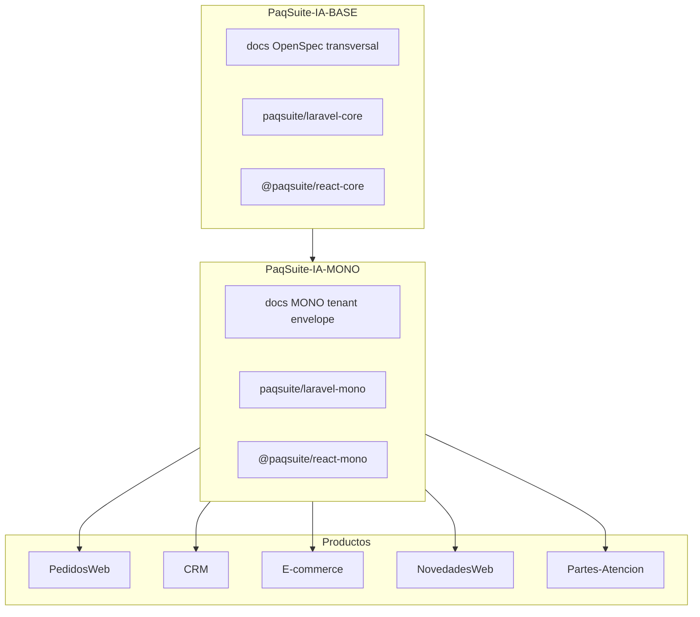

# Framework propio PaqSuite — reutilizar Generalidades entre productos

> **Ubicación versionada:** [`.cursor/plans/paqsuite-framework-compartido.plan.md`](./paqsuite-framework-compartido.plan.md) — incluir en Git junto al repo para compartir con el equipo.

## Respuesta corta

**Sí.** No hace falta inventar un framework desde cero: ya tenés la **capa conceptual** (BASE → MONO → producto) en [`docs/_base/symlinks_paqsuite_ia.md`](docs/_base/symlinks_paqsuite_ia.md). Lo que falta es llevar **el mismo modelo al código ejecutable** que hoy está embebido en PedidosWeb (`ApiResponse`, login, shell, `DataGridDx`, layouts, i18n, etc.).

Eso es un **platform SDK** (no un framework genérico tipo Laravel/React): convenciones PaqSuite + librerías versionadas + scaffold.

---

## Estado actual (PedidosWeb como referencia)

| Capa | Qué se comparte hoy | Cómo |
|------|---------------------|------|
| **Docs / OpenSpec GEN** | SPEC-001-* Generalidades | Symlinks `docs/_base`, `docs/00-contexto/_mono` |
| **Reglas Cursor / prompts** | Comportamiento IA | Symlinks `.cursor/rules/base`, `mono` |
| **Código backend GEN** | ApiResponse, Auth, menú, preferencias, grid layouts… | **Copiado** en `backend/app/` del producto |
| **Código frontend GEN** | client HTTP, LoginPage, shell, DataGridDx, i18n… | **Copiado** en `frontend/src/` del producto |
| **Dominio** | PedidosWeb, CRM, E-commerce… | Solo en cada repo |

El scaffold [`00-instalacion-scaffold-fullstack.md`](docs/00-contexto/_mono/00-instalacion-scaffold-fullstack.md) dice explícitamente: en un repo nuevo **repetir el patrón** copiando integraciones §3.2 — eso **no escala** a 5+ productos sin drift.

---

## Arquitectura objetivo (espejo de docs)

### Qué va en cada paquete

**`paqsuite/laravel-core` (BASE — todo producto)**

- `ApiResponse`, envelope, `Handler` de errores i18n
- OpenAPI helpers / traits L5-Swagger
- Contratos base (interfaces repository vacías transversales si aplica)
- Tests unitarios del envelope

**`paqsuite/laravel-mono` (MONO — monoempresa)**

- Middleware tenant `X-Paq-Cliente`
- Auth: `LoginService`, Sanctum, recuperación/cambio contraseña
- Menú API, preferencias usuario (locale, theme)
- Grid layouts API
- Seeders MVP seguridad (opcional subpaquete `paqsuite/laravel-mono-dev`)
- Migraciones **solo tablas transversales** (`users`, `pq_menus`, `pq_grid_layouts`, …) — coordinar con regla tablas SQL compartidas

**`@paqsuite/react-core` (BASE)**

- `apiRequest`, envelope parsing, errores tipados
- Init DevExtreme license
- Tokens CSS / theme base
- Utilidades i18n grid (sin doble anidación)

**`@paqsuite/react-mono` (MONO)**

- Shell layout, sidebar, avatar menu
- Login / forgot / change password (patrón auth DevExtreme)
- `DataGridDx`, layouts, export Excel, ABM modal pattern
- Hooks auth/session

**Cada producto (PedidosWeb, CRM, …)**

- `backend`: routes dominio, controllers, services, models ERP, policies producto
- `frontend`: `features/pedidos`, `features/crm`, rutas menú MVP producto
- `docs/05-open-spec/NNN-Producto/` — **solo** specs de negocio

---

## Tres estrategias posibles (comparación)

| Estrategia | Descripción | Pros | Contras | Recomendación |
|------------|-------------|------|---------|---------------|
| **A. Paquetes versionados** | Composer + npm privados (GitHub Packages / Verdaccio / Satis) | Limpio, semver, CI por paquete | Setup inicial registry + extracción | **Recomendada** |
| **B. Monorepo platform** | Un repo `PaqSuite-Platform` con `packages/*` y apps `apps/pedidosweb` | Un solo clone, Turborepo | Cambia modelo de repo por producto; permisos/acceso | Fase 2 si el equipo crece |
| **C. Template + copia** | Generador/scaffold que vuelca código GEN en cada producto | Bajo costo hoy | Drift entre productos; bugs GEN × N repos | **Estado actual** — migrar desde acá |

**No recomendado:** symlinks de código fuente (como docs) — rompe en Windows, Composer/npm, deploy y CI.

---

## Plan de extracción desde PedidosWeb v1.1.0-paq (incremental)

### Fase 0 — Contrato y límites

- Inventario GEN vs producto: matriz archivo → paquete (usar TR-GEN-* y carpetas `features/auth`, `shared/ui/DataGridDx`, etc.).
- Definir **API pública** de cada paquete (qué exporta, qué configura el producto vía ServiceProvider / props).
- Versionado alineado a plataforma: `1.1.0` platform = `^1.1` paquetes.

### Fase 1 — Backend core + mono (Composer)

1. Crear repo `PaqSuite-IA-PHP` (o carpeta en BASE) con packages:
   - `packages/laravel-core`
   - `packages/laravel-mono`
2. Mover desde PedidosWeb: `ApiResponse`, tenant middleware, auth stack, menú, preferencias.
3. Service providers registrables: `PaqSuiteCoreServiceProvider`, `PaqSuiteMonoServiceProvider`.
4. PedidosWeb: `composer require paqsuite/laravel-mono`; borrar duplicados; tests verdes.

### Fase 2 — Frontend core + mono (npm)

1. Repo `PaqSuite-IA-JS` con workspaces:
   - `packages/react-core`
   - `packages/react-mono`
2. Mover: `client.ts`, shell, auth pages, `DataGridDx`, grid layouts API clients.
3. PedidosWeb: `"@paqsuite/react-mono": "^1.1.0"`; imports desde paquete; build verde.

### Fase 3 — Scaffold nuevo producto

- Actualizar [`00-instalacion-scaffold-fullstack.md`](docs/00-contexto/_mono/00-instalacion-scaffold-fullstack.md):
  - `composer require paqsuite/laravel-mono`
  - `npm install @paqsuite/react-mono`
  - Solo pegar dominio + OpenSpec producto
- CLI opcional: `php artisan paqsuite:scaffold-product CRM` (genera rutas, menú seed stub).

### Fase 4 — Segundo producto piloto

- Clonar estructura en **CRM** o **NovedadesWeb** (el más parecido en GEN).
- Medir: líneas solo-dominio vs reutilizadas; tiempo de bootstrap.

---

## Extension points (cómo evita rigidez)

El “framework” no debe absorber lógica de negocio. Patrones:

| Mecanismo | Uso |
|-----------|-----|
| **ServiceProvider config** | `config/paqsuite.php`: tenant header, rutas API prefix, tablas seguridad |
| **Bindings / interfaces** | Producto implementa `CommercialProfileResolver` propio |
| **Menú seed por producto** | GEN provee loader; producto aporta `config/paqsuite_mvp.php` |
| **Rutas frontend** | Producto compone `createBrowserRouter([...monoRoutes, ...productRoutes])` |
| **Temas / i18n** | Paquete trae keys `grid.dx.*`; producto merge namespaces `pedidos.*`, `crm.*` |

---

## Relación con OpenSpec / IA

- **SPEC-001 Generalidades** sigue en BASE/MONO docs (fuente de verdad humana).
- **TR-GEN-*** implementadas **una vez** en paquetes; productos solo referencian versión.
- Reglas Cursor apuntan a paquetes: “no reimplementar login; usar `paqsuite/laravel-mono`”.
- Chatbot / manual: BASE docs + manual producto (como [`PedidosWeb.md`](docs/99-manual-usuario/PedidosWeb.md)).

---

## Riesgos

| Riesgo | Mitigación |
|--------|------------|
| Breaking change en GEN rompe N productos | Semver estricto; changelog; tests contract en paquetes |
| Paquete mono mezcla tablas ERP producto | Separar `laravel-mono` (transversal) de `laravel-pedidosweb` (dominio) |
| DevExtreme licencia en build | Variable en consumer; peerDependency `@paqsuite/react-mono` |
| SQL Server vs MySQL por producto | Core sin DB; mono solo abstracciones; producto configura connection |

---

## Recomendación para debatir con tu programador

1. **Adoptar estrategia A (paquetes Composer/npm)** alineada a repos BASE/MONO existentes.
2. **PedidosWeb v1.1.0-paq** como donante de la primera extracción (GEN ya cerrado en F).
3. **No** un monolito “framework” único: **4 paquetes** (`laravel-core`, `laravel-mono`, `react-core`, `react-mono`) + apps delgadas.
4. Mantener **OpenSpec y symlinks** para documentación; **paquetes versionados** para código.
5. Segundo producto (CRM o NovedadesWeb) valida el modelo antes de extraer más.

---

## Próximo paso concreto (si aprueban)

Documento de inventario **GEN → paquete** (1–2 días) + PoC: extraer solo `ApiResponse` + `client.ts` a repos package y consumir desde PedidosWeb en rama experimental.
