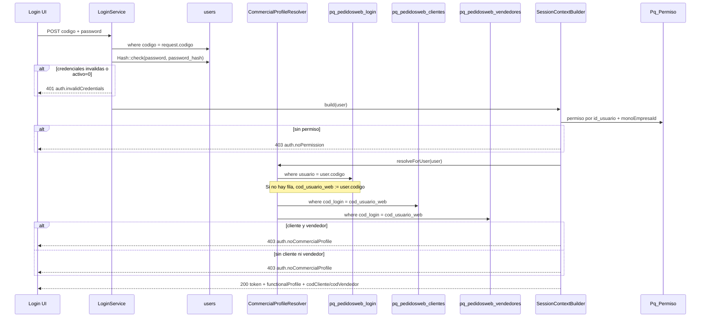

# Patrón de acceso — login y vínculo comercial

| Campo | Valor |
|-------|--------|
| **Estado** | Fuente de verdad (vigente) |
| **Implementación** | `LoginService`, `CommercialProfileResolver`, `SessionContextBuilder` |
| **TR relacionadas** | [TR-GEN-02-login-sesion](../../04-tareas/001-Generaliddes/TR-GEN-02-login-sesion.md), [TR-GEN-02-visibilidad-datos-pedidosweb](../../04-tareas/001-Generaliddes/TR-GEN-02-visibilidad-datos-pedidosweb.md), [HU-101-001-login](../../03-historias-usuario/101-PedidosWeb/HU-101-001-login.md) |

---

## 1) Resumen en una frase

**El usuario y la contraseña se validan solo en `users`.** Después del login, el sistema usa **`pq_pedidosweb_login`** (opcional como puente) para ubicar la entidad comercial en **`pq_pedidosweb_clientes`** o **`pq_pedidosweb_vendedores`** (cliente **o** vendedor/supervisor, nunca ambos).

---

## 2) Flujo (orden real en backend)



---

## 3) Tablas y responsabilidades

| Tabla / capa | Rol en el acceso |
|--------------|------------------|
| **`users`** | **Única fuente de autenticación:** `codigo` (login en pantalla), `password_hash`, `activo`, `inhabilitado`, `email`, preferencias. |
| **`Pq_Permiso`** + **`Pq_Rol`** | Autorización MONO: sin fila vigente → `auth.noPermission` (403). |
| **`pq_pedidosweb_login`** | **Puente legacy/comercial:** enlaza `users.codigo` (`usuario`) con `cod_usuario_web` (código web/comercial). **No valida contraseña** en el flujo nuevo. |
| **`pq_pedidosweb_clientes`** | Si `cod_login` coincide → perfil **cliente** (`functionalProfile = cliente`). |
| **`pq_pedidosweb_vendedores`** | Si `cod_login` coincide → perfil **vendedor** o **supervisor** (`supervisor = 1` → ve todos los clientes). |

---

## 4) Cadena canónica del vínculo comercial

```
users.codigo
    → pq_pedidosweb_login.usuario (= users.codigo)
    → pq_pedidosweb_login.cod_usuario_web  (si no hay fila: se usa users.codigo)
        → pq_pedidosweb_clientes.cod_login   OR
        → pq_pedidosweb_vendedores.cod_login
```

**Reglas:**

1. Solo **una** entidad activa: cliente **o** vendedor. Si ambas existen para el mismo `cod_login` → `auth.noCommercialProfile`.
2. Si ninguna existe → `auth.noCommercialProfile`.
3. El campo de login en API/UI es siempre **`codigo`** (`users.codigo`), no `name_user` ni el campo `usuario` libre de legacy.

---

## 5) Qué NO hace `pq_pedidosweb_login` en PedidosWeb actual

| Acción | Tabla |
|--------|--------|
| Validar contraseña en login | **`users.password_hash`** |
| Emitir token Sanctum | **`users`** (Personal Access Token) |
| Permisos de menú / procedimientos | **`Pq_Permiso`**, **`PQ_RolAtributo`** |
| Recuperar / cambiar contraseña (escritura principal) | **`users`**; opcional sync de `password_bcrypt` en login legacy si `usuario = users.codigo` |

---

## 6) Sincronización `users` → `pq_pedidosweb_login`

Comando para completar filas faltantes (`usuario = users.codigo`):

```powershell
php artisan paqsuite:sync-pedidosweb-login-from-users
```

Servicio: `PedidoswebLoginFromUsersSyncService`.  
En seed MVP con `SEED_MVP_SYNC_COMMERCIAL=true`, `SecurityMvpSeeder` crea login + cliente/vendedor para usuarios del catálogo.

---

## 7) Errores que ve el usuario

| HTTP | Clave i18n | Causa típica |
|------|------------|----------------|
| 401 | `auth.invalidCredentials` | `codigo`/contraseña incorrectos, `activo=0`, `inhabilitado=1` (mismo mensaje que credenciales) |
| 403 | `auth.noPermission` | Sin `Pq_Permiso` en empresa MONO |
| 403 | `auth.noCommercialProfile` | Sin cliente ni vendedor, o perfil ambiguo |
| 400 | `tenant.invalid` | Header `X-Paq-Cliente` inválido |

---

## 8) Referencias de código

- `backend/app/Services/Auth/LoginService.php` — autenticación `users`
- `backend/app/Services/Auth/CommercialProfileResolver.php` — resolución cliente/vendedor
- `backend/app/Services/Auth/SessionContextBuilder.php` — contexto de sesión + permisos
- `backend/app/Services/Auth/PasswordRecoveryService.php` — `syncLegacyLogin()` hacia `pq_pedidosweb_login`
