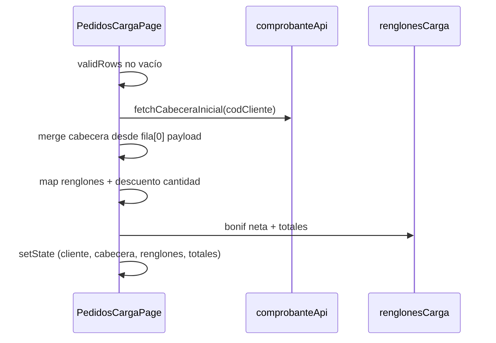

# TR-SPEC-101-16 — Importación Excel en pantalla de carga

| Campo | Valor |
|-------|--------|
| **HU relacionada** | [HU-101-030-importacion-excel-pantalla-carga](../../03-historias-usuario/101-PedidosWeb/HU-101-030-importacion-excel-pantalla-carga.md) |
| **SPEC relacionada** | [SPEC-101-16-importacion-pedido-individual-excel](../../05-open-spec/101-PedidosWeb/SPEC-101-16-importacion-pedido-individual-excel.md) |
| **Épica** | 101 — PedidosWeb |
| **Prioridad** | **Should** |
| **Dependencias** | [TR-SPEC-101-16-proceso-excel-pedido-individual](TR-SPEC-101-16-proceso-excel-pedido-individual.md); TR-SPEC-101-10-pantalla-carga; TR-GEN-07-ui-embebida-host; HU-101-007/008 (cálculos) |
| **Estado** | **C1 cerrado** — apto D1 |
| **Última actualización** | 2026-06-17 (Parte C1) |

**Origen:** [HU-101-030](../../03-historias-usuario/101-PedidosWeb/HU-101-030-importacion-excel-pantalla-carga.md)  
**Fuente UI:** [pantalla-carga-comprobante-ui.md](../../02-producto/PedidosWeb/pantalla-carga-comprobante-ui.md)  
**Normas transversales:** [`../_NORMAS-TRANSVERSALES-TR.md`](../_NORMAS-TRANSVERSALES-TR.md)

---

## 1) HU refinada (resumen)

### Título
Toolbar Excel embebido en carga de pedido/presupuesto con volcado a formulario.

### Narrativa
Como usuario en comprobante nuevo, quiero importar planilla Excel y ver cabecera y renglones precargados, para cargar muchas líneas sin tipeo manual.

### In scope / Out of scope
- **In scope:** `ExcelImportHostToolbar` en `PedidosCargaPage`; reglas `disabled`; `onComplete` hidrata cabecera/renglones; cálculos `renglonesCarga.ts`; i18n host; E2E.
- **Out of scope:** catálogo/handler (TR-029); cambios contrato modal GEN-07.

---

## 2) Criterios de aceptación (AC)

| AC | Verificación |
|----|----------------|
| CA-01 | Toolbar visible si `excelImportEnabled` y modo nuevo |
| CA-02 | Oculto/deshabilitado en edición |
| CA-03 | V/S: import deshabilitado con cliente en combobox |
| CA-04 | V/S: import deshabilitado con renglones |
| CA-05 | C: import habilitado en nuevo |
| CA-06 | Volcado exitoso: cliente + N renglones |
| CA-07 | Errores: formulario sin cambios |
| CA-08 | Edición manual post-import |
| CA-09 | Importes = carga manual equivalente |
| CA-10 | Totales actualizados |
| CA-11 | Grabar post-import (validaciones 009/010 + CC PQ #6) |
| CA-12 | i18n + `data-testid` |
| CA-13 | E2E import → renglones visibles |

### Escenarios Gherkin

(Heredados de HU-101-030.)

---

## 3) Reglas de negocio (UI)

```typescript
// Pseudocódigo — PedidosCargaPage (C1)
const tieneRenglonesCargados = renglonesValidosParaGrabar(renglones).length > 0;

const excelImportDisabled =
  !excelImportEnabled ||
  readOnly ||
  modo !== 'nuevo' ||
  Boolean(comprobanteId) ||
  tieneRenglonesCargados ||
  (!isClienteProfile && selectedCliente !== null);
```

| Regla | Detalle |
|-------|---------|
| RN-UI-01 | `excelImportEnabled` desde `fetchPublicConfig()` en `useEffect` (mismo patrón que `ConsultaGrillaPivotShell`) |
| RN-UI-02 | Perfil **C:** no exigir `selectedCliente === null` |
| RN-UI-03 | Copia/modo con renglones precargados → `excelImportDisabled` |
| RN-UI-04 | `onComplete` con `validRows.length === 0` → no-op |
| RN-UI-05 | Hidratación con `isDevExtremeUserChange` guard |
| RN-UI-06 | `porc_bonif` ya resuelto en payload TR-16a (descuento cantidad en `processRow`); mapper UI solo copia a `ComprobanteRenglon` |

### Constante proceso

```typescript
export const EXCEL_PROCESO_PEDIDO_INDIVIDUAL = 'PEDIDO_INDIVIDUAL' as const;
```

Archivo sugerido: `frontend/src/features/pedidos/constants/excelImportCarga.ts`.

---

## 3.1) Flujo `onComplete`



### Orden (B1 cerrado)

1. `setSelectedCliente(cod_cliente)` + incrementar `clienteSelectKey` si aplica.
2. `fetchCabeceraInicial` → catálogos.
3. `applyImportedCabecera(cabeceraApi, row0)` — overlay campos Excel.
4. `mapImportedRenglones(validRows)` → `ComprobanteRenglon[]` (incluye `porcBonif` desde `porc_bonif`).
5. `calcularBonificacionNeta` + recálculo por renglón (`calcularPrecioNetoUnitario`, etc.) + `calcularTotalesComprobante`.

### Utilidad nueva

- `frontend/src/features/pedidos/utils/mapExcelImportToCarga.ts`
  - `mapExcelRowToCabecera(row, base): ComprobanteCabecera`
  - `mapExcelRowsToRenglones(rows): ComprobanteRenglon[]`

Mapeo snake payload → camelCase tipos existentes (`codCliente`, `listaPrecios`, `bonif1`, `porcBonif` ← `porc_bonif`, `precio` ← `precio`, etc.).

---

## 3.2) Descuento por cantidad (C1 — cerrado)

Resuelto en **TR-16a** `processRow` vía `ArticuloRepository::findDescuentoCantidad`. TR-16b **no** agrega llamadas API adicionales; el mapper asigna `porcBonif` desde `row.porc_bonif` y ejecuta el mismo recálculo que carga manual.

---

## 4) Impacto en datos

Sin cambios de esquema. Solo estado React en pantalla hasta grabar.

---

## 5) Contratos API (consumo)

| API | Uso |
|-----|-----|
| GEN-07 embebido | `ExcelImportHostToolbar` → `validRows` |
| `GET /clientes/{cod}/cabecera-inicial` | Post-import init |
| `GET /config/parametros-carga` | Ya cargado; respetar `Modifica*` en UI post-import |
| `POST /comprobantes/grabar` | CA-11 — sin cambios contrato |

---

## 6) Cambios frontend

### `PedidosCargaPage.tsx`

| Cambio | Detalle |
|--------|---------|
| Import | `ExcelImportHostToolbar`, `ExcelImportHostResult`, `EXCEL_PROCESO_PEDIDO_INDIVIDUAL` |
| Layout | Zona toolbar superior (B1): `div.pedidosCargaExcelToolbar` **antes** de cabecera; no desplaza Grabar/Cancelar |
| Handler | `handleExcelImportComplete` |
| Flag | `useState` + `fetchPublicConfig()` al montar página |

### data-testid

| Control | data-testid |
|---------|-------------|
| Contenedor toolbar Excel | `pedidos-carga-excel-toolbar` |
| (heredados GEN-07) | `excelHostToolbar`, `excelHostImport` |

### i18n nuevas claves

Prefijo `pedidos.carga.excelImport.*`:

- `toolbarHint` — texto opcional junto a botones
- `importSuccess` — toast tras volcado OK (opcional)
- `importNoChanges` — si usuario cierra con errores (opcional)

Reutilizar `excelImport.*` del componente genérico para modal.

---

## 7) Plan de tareas

| ID | Tipo | Descripción | DoD |
|----|------|-------------|-----|
| T1 | FE | `mapExcelImportToCarga.ts` + unit Vitest | Mapeo cabecera/renglones |
| T2 | FE | Integrar toolbar + `excelImportDisabled` | CA-01..05 |
| T3 | FE | `handleExcelImportComplete` + guards DX | CA-06..08 |
| T4 | FE | Recálculo totales `renglonesCarga.ts` | CA-09, CA-10 |
| T5 | FE | i18n `pedidos.carga.excelImport.*` | CA-12 |
| T6 | Tests | Vitest mapper + disabled rules | |
| T7 | E2E | `pedidos-excel-import.spec.ts` mock API | CA-13 |
| T8 | Manual | Actualizar `PedidosWeb.md` § carga (opcional Parte Q) | |

**Dependencia:** T2–T7 requieren TR-16a desplegado o mocks de `validRows` en tests.

**Tarea T5 descuento cantidad eliminada** — cubierta por TR-16a (C1).

---

## 8) Estrategia de tests

### Vitest

- `mapExcelImportToCarga.test.ts` — cabecera merge, renglones numerados, `porcIva` normalizado.
- `pedidosCargaExcelImportDisabled.test.ts` — matriz perfil/modo/cliente/renglones.

### E2E Playwright

```gherkin
# Escenario mínimo CA-13
Given login vendedor + excelImportEnabled mock true
And mock POST lotes + filas validas PEDIDO_INDIVIDUAL
When importa desde pedidos/carga nuevo
Then grid-renglones-carga muestra al menos 1 fila
And cliente-cargado o cliente-select con valor
```

Archivo sugerido: `frontend/tests/e2e/pedidosweb/pedidos-excel-import.spec.ts`.

### Integración grabar (CA-11)

Reutilizar patrón `mvp-section9.spec.ts` — paso opcional post-import.

---

## 9) Riesgos y edge cases

| ID | Riesgo | Mitigación |
|----|--------|------------|
| R1 | Eventos DX pisan cabecera importada | `isDevExtremeUserChange` + flag `hydratingFromExcelImport` ref |
| R2 | Race `fetchCabeceraInicial` vs overlay | `await` secuencial en handler |
| R3 | Lista precios cambia moneda tras import | Resolver en handler TR-16a (`cod_lista` + `precio`) |
| R4 | Usuario importa y cambia cliente manualmente | Import ya deshabilitado tras volcado (hay cliente + renglones) |
| R5 | TR-16a no listo | Feature flag solo UI; tests con mock `onComplete` |

---

## 10.1) Revisión C1 (2026-06-17)

| ID | Tema | Decisión D1 |
|----|------|-------------|
| AMB-C1-16b-01 | Fórmula `disabled` | Solo `modo === 'nuevo'` sin `comprobanteId`; `readOnly`; `renglonesValidosParaGrabar` |
| AMB-C1-16b-02 | Copia comprobante | `modo=copia` + `comprobanteId` → deshabilitado por `comprobanteId` y renglones precargados |
| AMB-C1-16b-03 | Descuento cantidad | En TR-16a `processRow`; UI solo mapea `porc_bonif` |
| AMB-C1-16b-04 | Config pública | `fetchPublicConfig()` local en página (no hook global aún) |
| AMB-C1-16b-05 | `codigoProceso` | Constante `EXCEL_PROCESO_PEDIDO_INDIVIDUAL` |
| AMB-C1-16b-06 | Hidratación DX | `hydratingFromExcelImport` ref + `isDevExtremeUserChange` |

**Veredicto C1:** **Apto** — sin bloqueantes D1.

**Observaciones no bloqueantes:** E2E con mocks API (sin workbook real en CI); CA-11 grabar post-import como escenario opcional en `mvp-section9` o spec dedicada; verificar que toolbar no oculte botones Grabar en viewport móvil.

---

## 10) Checklist final

- [ ] Toolbar solo en modo nuevo sin renglones (reglas V/S/C)
- [ ] `onComplete` no muta si `validRows` vacío
- [ ] Totales coherentes con HU-007/008
- [ ] `data-testid` estables
- [ ] E2E CA-13
- [ ] Sin regresión flujo carga manual (E2E §9)
- [ ] Documentación runbook si aplica flag `.env`

---

## Archivos previstos

### Frontend
- `frontend/src/features/pedidos/pages/PedidosCargaPage.tsx`
- `frontend/src/features/pedidos/utils/mapExcelImportToCarga.ts`
- `frontend/src/features/pedidos/utils/mapExcelImportToCarga.test.ts`
- `frontend/src/features/pedidos/constants/excelImportCarga.ts`
- `frontend/src/features/pedidos/utils/pedidosCargaExcelImportDisabled.ts` (pure fn exportada para tests)
- `frontend/src/features/pedidos/utils/pedidosCargaExcelImportDisabled.test.ts`
- `frontend/tests/e2e/pedidosweb/pedidos-excel-import.spec.ts`
- `frontend/src/locales/*.json` (`pedidos.carga.excelImport.*`)

### Sin cambios backend en v1

Descuento cantidad resuelto en TR-16a.
