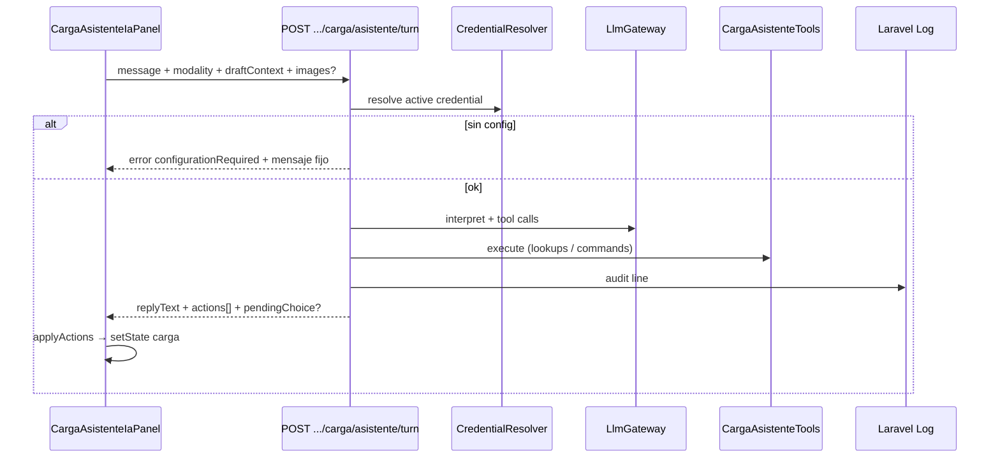

# TR-SPEC-101-18 — Asistente IA carga: shell, gate, audio e imagen

| Campo | Valor |
|-------|--------|
| **HU relacionadas** | [HU-101-037](../../03-historias-usuario/101-PedidosWeb/HU-101-037-asistente-carga-ia-panel-gate.md) · [HU-101-038](../../03-historias-usuario/101-PedidosWeb/HU-101-038-asistente-carga-ia-audio-imagen.md) |
| **SPEC relacionada** | [SPEC-101-18](../../05-open-spec/101-PedidosWeb/SPEC-101-18-asistente-carga-ia-shell.md) |
| **Épica** | 101 — PedidosWeb / Asistente IA en carga |
| **Prioridad** | **Should** |
| **Dependencias** | TR-SPEC-101-10; TR-GEN-10-configuracion-asistente-ia; `ChatAssistantCredentialResolver` / readiness; SPEC-001-10 límites imagen |
| **Estado** | **C1 cerrado** — apto D1 (2026-07-13) |
| **Última actualización** | 2026-07-13 |

**Normas transversales:** [`../_NORMAS-TRANSVERSALES-TR.md`](../_NORMAS-TRANSVERSALES-TR.md)  
**Cierre C1:** [F-101-18-20-cierre-c1](F-101-18-20-cierre-c1-asistente-carga-ia.md)

---

## 1) HU refinada (resumen)

### In scope
- Panel pie carga (colapsable; hilo expandido **mín. 270px** / `max(270px, 33vh)` + scroll interno), testids, i18n, DevExtreme.
- Ruedita → Preferencias Asistente IA.
- Gate BYOK FE+BE; API dedicada de turno; hilo efímero; pending cancel; auditoría log.
- Web Speech → texto; adjunto imagen (límites GEN-10); sin visión → mensaje.
- Contrato `resultado` para sync con mutaciones/consultas (TR-19/20).

### Out of scope
- Acciones A–J / apply K negocio → TR-19.
- Tools stock/deuda/cheques/historial → TR-20.
- Chat documental / nuevas tablas BYOK / STT proveedor.

---

## 2) Criterios de aceptación (AC)

| AC HU | Verificación |
|-------|----------------|
| 037 CA-01…05 | Panel pie, colapsado, altura, testids, ruedita Preferencias |
| 037 CA-06…07 | Gate sin LLM FE+BE |
| 037 CA-08 | Path dedicado (no `/chat-assistant/messages`) |
| 037 CA-09…11 | Hilo efímero, cancel pending, log auditoría |
| 037 CA-12 | Contrato sync documentado + hook FE |
| 038 CA-01…10 | Web Speech, visión, límites, modalidades auditoría |

Gherkin: heredar HU-037/038.

---

## 3) Arquitectura del turno



### Decisiones técnicas (C1)

| ID | Decisión |
|----|----------|
| T-18-01 | Un solo endpoint de turno: `POST /api/v1/pedidos/carga/asistente/turn` |
| T-18-02 | Borrador vive en FE; BE no persiste hilo ni borrador (salvo grabar vía TR-19) |
| T-18-03 | BE devuelve `actions[]` tipadas; FE las aplica al estado de `PedidosCargaPage` |
| T-18-04 | Lookups/consultas se ejecutan en BE (tools) y vuelven en `actions` / `replyText` |
| T-18-05 | Reusar `ChatAssistantCredentialResolver` + readiness; **no** corpus documental |
| T-18-06 | Prefijo log: `carga.asistente` (canal default → `storage/logs/laravel.log`) |
| T-18-07 | Audio 100% FE (Web Speech); BE solo recibe `modality: "audio"` + texto |
| T-18-08 | Imágenes: mismo multipart/base64 patrón que chat assistant messages; no persistir archivos |

---

## 4) Impacto en datos

Sin tablas nuevas. BYOK existente: `pq_asistente_ia_proveedores`, `pq_asistente_ia_credenciales`.

---

## 5) Contratos API

### 5.1 `POST /api/v1/pedidos/carga/asistente/turn`

| Ítem | Valor |
|------|--------|
| Auth | Bearer Sanctum + `X-Paq-Cliente` |
| Permiso | Usuario autenticado con acceso a pantalla carga (`pw_cargapedidos` / equivalente vigente) |
| **OpenAPI** | Sí — `operationId=pedidosCargaAsistenteTurn`; schemas `CargaAsistenteTurnRequest` / `ApiEnvelopeCargaAsistenteTurn`; security sanctum+tenant; 401/403/422 |
| Content-Type | `application/json` o `multipart/form-data` si hay imágenes |

**Request JSON (campos):**

| Campo | Tipo | Obligatorio | Notas |
|-------|------|-------------|-------|
| `message` | string | sí (salvo solo imagen) | Texto usuario o dictado |
| `modality` | `texto` \| `audio` \| `imagen` | sí | Auditoría |
| `credentialId` | int \| null | no | Misma semántica chat assistant |
| `pendingChoice` | object \| null | no | `{ kind, options[] }` eco del turno anterior |
| `draftContext` | object | sí | Ver §5.2 |
| `images` | array | no | Hasta 4; png/jpg/jpeg/webp; ≤5 MB c/u (SPEC-001-10) |

**`draftContext` (mínimo):**

```json
{
  "modo": "nuevo|edicion|soloLectura",
  "perfilUsuario": "V|S|C",
  "codCliente": null,
  "cabecera": { "listaPrecios": null, "observaciones": null },
  "renglones": [
    { "codArticulo": "A1", "cantidad": 2, "precio": 10.5, "porcBonif": 0 }
  ],
  "readOnly": false
}
```

**Éxito `error: 0` — `resultado`:**

```json
{
  "replyText": "string i18n-ready o texto asistente",
  "actions": [
    {
      "action": "noop|needsChoice|needsRefine|needsConfirm|selectCliente|setCabeceraField|setCampoLibre|addRenglon|updateRenglon|confirmChangeCliente|rejectChangeCliente|grabarPedido|grabarPresupuesto|showConsulta|applyImageExtract|denied|validationError",
      "payload": {},
      "resultado": "ok|needsChoice|needsRefine|needsConfirm|denied|validationError"
    }
  ],
  "pendingChoice": null,
  "configurationRequired": false
}
```

**Gate sin LLM:** HTTP 422 o 200 con `error ≠ 0` — preferir **mismo patrón que chat assistant** (`configurationRequired`). Cuerpo:

| Campo | Valor |
|-------|--------|
| `error` | código familia 2000/3000 alineado a `ChatAssistantMessageErrorCodes` o nuevo `CargaAsistenteErrorCodes` |
| `respuesta` | clave i18n `carga.asistente.configurationRequired` |
| `resultado` | `{ "configurationRequired": true, "preferencesPath": "/preferencias/..." }` |

**UI:** mensaje fijo + CTA Preferencias (CA-UX02).

### 5.2 Sin otros endpoints en este TR

Health/credenciales: reutilizar `GET /api/v1/chat-assistant/me/configuration` (solo lectura FE para hint de gate opcional).

---

## 6) Cambios frontend

| Área | Detalle |
|------|---------|
| Componente | `frontend/src/features/pedidos/cargaAsistenteIa/` — `CargaAsistenteIaPanel.tsx`, hooks, css |
| Host | Integrar en `PedidosCargaPage` (y rama mobile carga) al pie |
| Altura | CSS hilo `min-height: 16.875rem` (270px), `height/max-height: max(270px, 33vh)`; default colapsado |
| Web Speech | `webkitSpeechRecognition` / `SpeechRecognition`; fallback mensaje si no hay API |
| Imagen | file input + preview; validar límites antes de POST |
| Apply | `applyCargaAsistenteActions(actions, setters)` — stub en 18; completo en TR-19/20 |
| Preferencias | Misma navegación que chat (`cargaAsistenteIaConfig`) |
| i18n | Prefijo `carga.asistente.*` (5 locales) |

### data-testid

| Control | testid |
|---------|--------|
| Panel | `cargaAsistenteIaPanel` |
| Input | `cargaAsistenteIaInput` |
| Send | `cargaAsistenteIaSend` |
| Mic | `cargaAsistenteIaMic` |
| Attach | `cargaAsistenteIaAttach` |
| Config | `cargaAsistenteIaConfig` |
| Collapse toggle | `cargaAsistenteIaToggle` |

---

## 7) Cambios backend

| Pieza | Detalle |
|-------|---------|
| Route | `routes/api.php` grupo auth — `pedidos/carga/asistente/turn` |
| Controller | `CargaAsistenteTurnController` |
| Service | `CargaAsistenteTurnService` — gate → LLM → tools registry |
| Tools | Registry vacío/parcial en 18; registrar tools en TR-19/20 |
| LLM | Reusar gateway chat **sin** retrieval documental; system prompt “operativo carga” |
| Log | `Log::info('carga.asistente', [...])` |
| OpenAPI | Anotaciones L5-Swagger |
| Errors | `CargaAsistenteErrorCodes` (+ map i18n) |

---

## 8) Plan de tareas

| ID | Tipo | Descripción | DoD |
|----|------|-------------|-----|
| T18-1 | BE | Route + controller + gate credential + OpenAPI | 401/gate test |
| T18-2 | BE | Turn service + LLM stub/gateway sin corpus + audit log | Unit |
| T18-3 | FE | Panel UI + i18n + testids + altura/colapso | CA panel |
| T18-4 | FE | Client `postCargaAsistenteTurn` + apply stub | Integración |
| T18-5 | FE | Web Speech + attach imagen + validaciones | CA 038 |
| T18-6 | Test | Feature PHP gate + Vitest panel + E2E smoke gate | §9 |

**Orden:** T18-1 → T18-2 → T18-3/4 en paralelo → T18-5 → T18-6.

---

## 9) Estrategia de tests

| Capa | Casos |
|------|--------|
| PHPUnit Feature | Sin token 401; sin credential → configurationRequired; con mock LLM → 200 envelope |
| Unit | Prompt builder no incluye corpus; audit fields |
| Vitest | Collapse/altura; disabled send vacío; validate image limits |
| E2E | Mock turn: sin config muestra CTA; con config envía texto |

---

## 10) Checklist OpenAPI / normas

- [ ] security Bearer + X-Paq-Cliente
- [ ] 401 / error controlado gate
- [ ] Envelope `error`/`respuesta`/`resultado`
- [ ] Matriz permiso carga documentada
- [ ] Tests 401 + gate

---

## 11) Riesgos

| Riesgo | Mitigación |
|--------|------------|
| Web Speech ausente en WebView | Mensaje i18n; no bloquear texto |
| Prompt injection | Tools con allowlist; BE revalida permisos en TR-19/20 |
| Token LLM costoso | Reusar modelo BYOK; sin historial BD |

---

## Veredicto C1

**Apto para D1** — ver [F-101-18-20-cierre-c1](F-101-18-20-cierre-c1-asistente-carga-ia.md).
