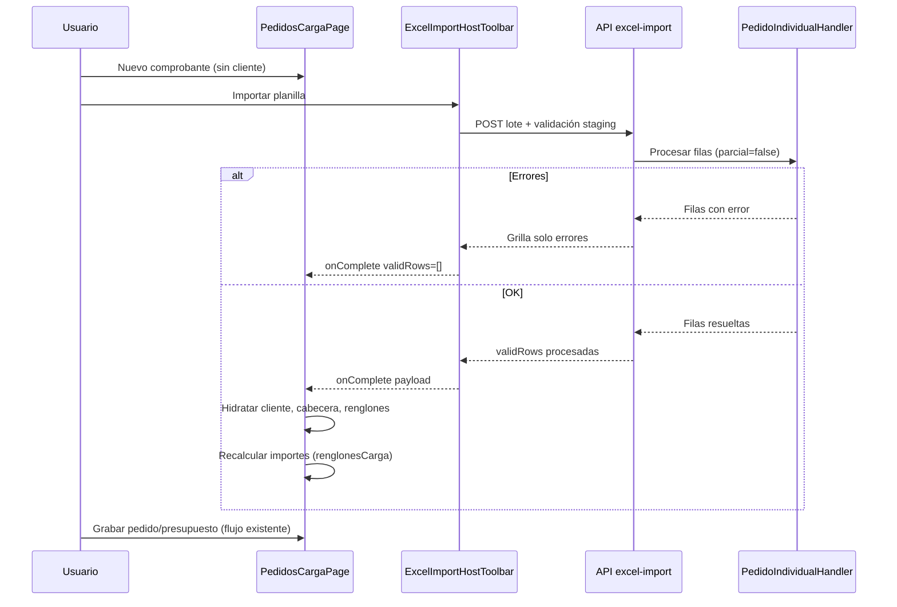

# SPEC-101-16 — Importación pedido individual desde Excel

| Campo | Valor |
|-------|--------|
| **SPEC madre** | [PedidosWeb_SPEC_MVP.md](PedidosWeb_SPEC_MVP.md) |
| **Producto** | [Importación Pedido Individual desde Excel.md](../../02-producto/PedidosWeb/Importación%20Pedido%20Individual%20desde%20Excel.md) |
| **Estado** | Especificado — **A1 + B1 + C + C1 cerrados** (2026-06-17) |
| **Prioridad épica** | Should (extensión post-MVP; motor GEN-07 ya implementado) |
| **Revisión A1** | Apto con observaciones (2026-06-17) |
| **HU relacionadas** | [HU-101-029](../../03-historias-usuario/101-PedidosWeb/HU-101-029-proceso-excel-pedido-individual.md), [HU-101-030](../../03-historias-usuario/101-PedidosWeb/HU-101-030-importacion-excel-pantalla-carga.md) |
| **TR relacionadas** | [TR-SPEC-101-16-proceso-excel-pedido-individual](../../04-tareas/101-PedidosWeb/TR-SPEC-101-16-proceso-excel-pedido-individual.md), [TR-SPEC-101-16-importacion-excel-pantalla-carga](../../04-tareas/101-PedidosWeb/TR-SPEC-101-16-importacion-excel-pantalla-carga.md) |

## Objetivo

Integrar en la **pantalla de carga** de pedido/presupuesto el componente embebido de importación Excel (GEN-07) para **un único comprobante**: el usuario descarga plantilla modelo, completa filas (artículos + datos de cabecera repetidos) e importa; el sistema valida **sin procesamiento parcial**, resuelve defaults de negocio y vuelca cabecera y renglones en el formulario de carga con los mismos cálculos que la operatoria manual.

## Fuentes

| Fuente | Rol |
|--------|-----|
| [Importación Pedido Individual desde Excel.md](../../02-producto/PedidosWeb/Importación%20Pedido%20Individual%20desde%20Excel.md) | Requerimiento producto |
| [Impotación Pedido desde Excel.png](../../02-producto/PedidosWeb/Impotación%20Pedido%20desde%20Excel.png) | Catálogo columnas, obligatoriedad y defaults ante vacío |
| [SPEC-001-07-importar-excel](../001-Generaliddes/SPEC-001-07-importar-excel.md) | Motor genérico `PQ_EXCEL_*`, APIs, staging |
| [patron-componente-excel-embebido.md](../../00-contexto/_mono/importar-excel/patron-componente-excel-embebido.md) | UI embebida, modal, `onComplete` |
| [SPEC-101-10-pantalla-carga.md](SPEC-101-10-pantalla-carga.md) | Pantalla host, permisos precio/lista/bonif., cabecera y renglones |
| [pantalla-carga-comprobante-ui.md](../../02-producto/PedidosWeb/pantalla-carga-comprobante-ui.md) | Contrato UI carga (comboboxes, cálculos, leyendas) |
| `frontend/src/features/pedidos/utils/renglonesCarga.ts` | Fórmulas bonificación neta, precio neto e importes |

## Alcance (in scope)

### 1. Proceso Excel en catálogo

Registrar proceso **`PEDIDO_INDIVIDUAL`** en `PQ_EXCEL_PROCESOS` / `PQ_EXCEL_PROCESOS_CAMPOS` (seeder idempotente):

| Atributo proceso | Valor |
|------------------|-------|
| `codigo_proceso` | `PEDIDO_INDIVIDUAL` |
| `nombre_proceso` | Importación pedido individual |
| `permite_procesamiento_parcial` | **`false`** (producto: sin ingreso parcial) |
| `permite_solo_validar` | **`false`** (debe procesar y entregar payload al host) |
| `genera_plantilla` | `true` |
| `handler_backend` | Handler dedicado (ej. `Importacion.Pedidos.IndividualHandler`) |
| `procedimiento_host` | `pw_cargapedidos` (misma visibilidad que pantalla carga) |
| `activo` | `true` |

### 2. Columnas de plantilla

Orden y metadatos según imagen de producto. El **identificador estable** es `nombre_campo_interno`; el **título visible en fila 1** del Excel sale de **i18n** según el idioma activo del portal. La tabla usa **español** como referencia de producto; en runtime prevalece la clave i18n (§2.1).

| # | Campo interno | Clave i18n (`excelImport.column.PEDIDO_INDIVIDUAL.*`) | Oblig. estructural | Comportamiento si vacío |
|---|---------------|------------------------------------------------------|--------------------|-------------------------|
| 1 | `cod_cliente` | `codCliente` — ej. es: «codigo cliente» | **Sí** | Error |
| 2 | `cod_articulo` | `codArticulo` — ej. es: «codigo de articulo» | **Sí** | Error |
| 3 | `cantidad` | `cantidad` | **Sí** | Error |
| 4 | `precio_lista` | `precioLista` | No | Precio de la lista vigente para el artículo |
| 5 | `bonif_renglon` | `bonifRenglon` | No | Bonificación del artículo (`pq_pedidosweb_articulos.bonificacion`) |
| 6 | `cod_perfil` | `codPerfil` | No | Parámetro ERP `CodPerfilPedidos` |
| 7 | `cod_condvta` | `codCondvta` | No | Condición de venta del cliente |
| 8 | `cod_transpor` | `codTranspor` | No | Transporte habitual del cliente |
| 9 | `id_de` | `idDe` | No | Dirección de entrega habitual del cliente |
| 10 | `cod_lista` | `codLista` | No | Lista del cliente; si no tiene, parámetro/default del tenant |
| 11 | `nivel` | `nivel` | No | `0` |
| 12 | `bonif1` | `bonif1` | No | Bonificación 1 del cliente |
| 13 | `bonif2` | `bonif2` | No | `0` |
| 14 | `bonif3` | `bonif3` | No | `0` |
| 15 | `expreso` | `expreso` | No | Valor del cliente |
| 16 | `expreso_dire` | `expresoDire` | No | Valor del cliente |
| 17 | `fecha_entrega` | `fechaEntrega` | No | Vacío |
| 18 | `observaciones` | `observaciones` | No | Vacío |
| 19 | `leyenda1` | `leyenda1` | No | Si `ClienteLeyenda1` activo → leyenda del cliente; si no → vacío |
| 20 | `leyenda2` | `leyenda2` | No | Idem `ClienteLeyenda2` |
| 21 | `leyenda3` | `leyenda3` | No | Idem `ClienteLeyenda3` |
| 22 | `leyenda4` | `leyenda4` | No | Idem `ClienteLeyenda4` |
| 23 | `leyenda5` | `leyenda5` | No | Idem `ClienteLeyenda5` |

> **Nota documental:** en la imagen de producto, la fila «codigo de transporte» repite texto de condición de venta; se interpreta como **transporte del cliente** (coherente con cabecera de carga).

Tipos de dato sugeridos: `codigo` / `texto` / `decimal` (cantidad, precios, bonificaciones) / `fecha` (`fecha_entrega`).

#### 2.1 i18n — encabezados y comentarios de plantilla

| Aspecto | Regla |
|---------|-------|
| **Idiomas** | Los 5 del portal: `es`, `en`, `fr`, `pt`, `it` (`frontend/src/locales/*.json` + espejo backend si la plantilla se genera en API). |
| **Locale activo** | Mismo que la sesión UI (`i18n.language`); la descarga de plantilla envía `Accept-Language` (o `?locale=`) al `GET .../plantilla`. |
| **Clave encabezado** | `excelImport.column.PEDIDO_INDIVIDUAL.{campo}` — texto **sin tildes** en todos los idiomas (alineado GEN-07 § encabezado). |
| **Comentario obligatorio** | `excelImport.columnComment.required` (no literal fijo `OBLIGATORIO` en un solo idioma). |
| **Comentario ayuda** | `excelImport.columnComment.PEDIDO_INDIVIDUAL.{campo}` cuando aplique hint de negocio. |
| **Catálogo BD** | `PQ_EXCEL_PROCESOS_CAMPOS.nombre_columna_excel` = **fallback `es`** o clave interna; el motor resuelve título vía i18n cuando hay locale. |
| **Importación** | El parser debe reconocer el encabezado de fila 1 en **cualquiera** de los 5 idiomas del proceso (mapa inverso `título traducido → nombre_campo_interno`), para que un archivo descargado en inglés se importe aunque el usuario cambie idioma después. |
| **Export errores** | Mismos títulos i18n que la plantilla del proceso (locale al exportar o columnas del lote según TR). |
| **Grilla errores modal** | Captions i18n (`excelImport.column.PEDIDO_INDIVIDUAL.*`), no `nombre_columna_excel` crudo del catálogo. |

> **Estado GEN-07 hoy:** la plantilla piloto (`ARTICULOS_ALTA`) usa `nombre_columna_excel` fijo en BD **sin** i18n. Este proceso **establece el patrón i18n** que deberá extenderse al motor transversal en la TR/HU (extensión GEN-07, no solo PedidosWeb).

### 3. Reglas de validación (handler + staging)

| Regla | Detalle |
|-------|---------|
| **Sin parcial** | Si ≥ 1 fila con error → **no** se entrega payload al host (`validRows: []`, patrón embebido §4). |
| **Un solo cliente por archivo** | Todas las filas deben tener el mismo `cod_cliente`; divergencia → error en filas afectadas. |
| **Solo carga nueva** | Habilitar importación únicamente en modo **alta** (comprobante nuevo sin `codPedido`). **No** en edición de pedido/presupuesto existente. |
| **Cliente no elegido en UI (V/S)** | Perfil **vendedor/supervisor:** botón **Importar** deshabilitado si el combobox cliente ya tiene valor (`selectedCliente` no vacío) **o** hay renglones cargados. |
| **Perfil cliente (C)** | Cliente fijo de sesión: importación **habilitada** en modo nuevo aunque `selectedCliente` esté precargado; `cod_cliente` en Excel debe coincidir con sesión o error. |
| **Coherencia cabecera** | Campos de cabecera (§2, excl. `cod_articulo`, `cantidad`, `precio_lista`, `bonif_renglon`) deben ser **idénticos en todas las filas**; divergencia → error por fila afectada. |
| **Permisos por tipo usuario** | Columnas que el usuario **no** puede editar en pantalla (parámetros `ModificaListaPrec*`, `ModificaPrecio*`, `ModificaBonArt*`, `ModificaBonCli*`) deben venir **vacías** en Excel; valor no vacío → error. Cliente (`C`): lista, precios y bonificaciones de renglón siempre vacíos en Excel. |
| **Visibilidad cliente** | Vendedor/supervisor: `cod_cliente` debe estar en cartera asignada. Cliente: debe coincidir con cliente de sesión. |
| **Artículo** | Código existente, no `usa_esc = 'B'`, visible según reglas de carga (SPEC-101-10). |
| **Cantidad** | `> 0`. |
| **Catálogos** | Perfil, condición, transporte, dirección, lista deben existir y ser válidos para el cliente cuando se informan o se resuelven por default. |
| **Nivel** | Si parámetro `NivelExtremo` = true → solo `0` o `100`. |
| **Precio cero** | Si `Articulopreciocero` o `Articulossinprecio` = false → ningún renglón con precio resuelto = 0. |
| **Cliente inhabilitado** | `pq_pedidosweb_clientes.inhabilitado = 0`. |

### 4. Resolución de defaults (backend handler)

Tras validación estructural, el handler resuelve por fila los vacíos según tabla §2 usando los mismos servicios/fuentes que `CabeceraInicialService` y carga de artículos (lista de precios activa, bonificación artículo, `porc_iva`, catálogos del cliente).

Los valores resueltos deben **persistirse en `datos_normalizados_json`** de cada fila válida (en `processRow` o equivalente) antes de que el host consuma `GET .../filas/validas`, ya que el contrato GEN-07 entrega `validRows` desde staging post-procesamiento.

El payload por fila debe incluir al menos: datos de cabecera resueltos, `cod_articulo`, `cantidad`, `precio` (lista), `porc_bonif`, `porc_iva`, `descripcion_articulo` — listos para mapear a `ComprobanteCabecera` y `ComprobanteRenglon`.

### 5. Integración UI (pantalla host)

| Aspecto | Regla |
|---------|-------|
| Componente | `ExcelImportHostToolbar` (`codigoProceso="PEDIDO_INDIVIDUAL"`) |
| Ubicación | Toolbar de `PedidosCargaPage` (junto a acciones existentes) |
| `disabled` | `true` si modo edición **o** (perfil V/S y `selectedCliente` no vacío) **o** hay renglones cargados |
| Visibilidad toolbar | Ocultar/deshabilitar si `EXCEL_IMPORT_ENABLED === false` (config pública `excelImportEnabled`, GEN-07) |
| `onComplete` | Con `validRows` no vacío: (1) fijar cliente y cargar catálogos (`GET` cabecera inicial); (2) aplicar cabecera desde primera fila; (3) reemplazar renglones con filas importadas; (4) recalcular bonificación neta, precio neto e importes con `renglonesCarga.ts`; (5) actualizar totales en UI. |
| `onComplete` vacío | Sin cambios en formulario; usuario puede corregir Excel y reintentar (nuevo lote). |
| i18n | Claves `pedidos.carga.excelImport.*`, `excelImport.column.PEDIDO_INDIVIDUAL.*`, `excelImport.columnComment.*` y reutilizar `excelImport.*` del componente genérico |
| `data-testid` | `excelHostToolbar`, `excelHostImport` (patrón GEN-07) |

### 6. Cálculos tras importación

Reutilizar **las mismas funciones** que la carga manual (`renglonesCarga.ts` / services 101-04):

| Concepto | Función / regla |
|----------|-----------------|
| Bonificación neta cabecera | `calcularBonificacionNeta(bonif1, bonif2, bonif3)` |
| Por renglón | Precio neto unitario, importe bruto, importe neto, IVA sobre neto, importe total (neto + IVA) |
| Totales cabecera | `calcularTotalesComprobante` |

No persistir en BD hasta que el usuario pulse **Grabar pedido** o **Grabar presupuesto** (mismo flujo que carga manual).

### 7. Entregables verificables

- Fila catálogo `PEDIDO_INDIVIDUAL` + campos en BD (seeder).
- Handler backend registrado en `ExcelImportHandlerRegistry`.
- Toolbar embebido en pantalla carga con reglas de habilitación.
- Tests: unit handler (defaults + errores), feature API lote/procesamiento, Vitest `onComplete` mock, E2E camino feliz import → renglones visibles.

## Fuera de alcance

- Importación **masiva** (varios comprobantes / varios clientes en un archivo).
- Importación en **edición** de pedido o presupuesto existente.
- Procesamiento parcial (filas válidas con errores en otras).
- Grabación automática del comprobante al cerrar importación (solo precarga formulario).
- Modificar motor genérico GEN-07 salvo registro del nuevo proceso/handler.
- Historial Excel: ya cubierto por GEN-07 (`PQ_EXCEL_IMPORTACIONES`).

## Dependencias

| Dependencia | Motivo |
|-------------|--------|
| **SPEC-001-07** + TR-GEN-07-* | Motor, APIs, componente embebido (D1/D2 cerrados); permiso = `pw_cargapedidos` (AMB-Q-07-01 cerrado) |
| **SPEC-101-10** | Pantalla host, permisos, estructura cabecera/renglones |
| **SPEC-101-04** | Validaciones de negocio al grabar (reutilizar criterios donde aplique) |
| **SPEC-101-06** | Visibilidad cliente por tipo usuario |
| **SPEC-001-04** (parámetros) | `CodPerfilPedidos`, `Modifica*`, `ClienteLeyenda*`, `NivelExtremo`, etc. |

## Flujo extremo a extremo

## Criterios de aceptación medibles

- [ ] **CA-01:** En comprobante nuevo sin cliente, toolbar muestra **Descargar plantilla** e **Importar**; ambos ocultos/deshabilitados en modo edición.
- [ ] **CA-02:** Perfil V/S: con cliente ya seleccionado en combobox, **Importar** deshabilitado. Perfil C: habilitado en nuevo con cliente fijo de sesión.
- [ ] **CA-03:** Plantilla `.xlsx` con 23 columnas en orden documentado; encabezados en **idioma activo**; obligatorias con comentario i18n `columnComment.required`.
- [ ] **CA-03b:** Archivo descargado en `en` se importa correctamente aunque la UI esté en `es` (parser multilenguaje).
- [ ] **CA-04:** Archivo con fila sin `codigo cliente`, `codigo de articulo` o `cantidad` → error; **ningún** dato en formulario.
- [ ] **CA-05:** Archivo con valor de cabecera distinto entre filas (ej. `bonif1`) → error; sin volcado parcial.
- [ ] **CA-05b:** Archivo con `cod_cliente` distinto entre filas → error.
- [ ] **CA-06:** Usuario vendedor con `ModificaListaPrecV=false` y columna lista con valor → error.
- [ ] **CA-07:** Importación exitosa: cabecera y N renglones en grilla; bonificación neta y totales coherentes con carga manual para el mismo dato.
- [ ] **CA-08:** Tras importación, grabación pedido/presupuesto exitosa con mismas validaciones que HU-101-009/010.
- [ ] **CA-09:** Lote registrado en historial Excel (`PQ_EXCEL_IMPORTACIONES`).

## Decisiones humanas (cerradas en Parte A)

| Tema | Decisión |
|------|----------|
| Código proceso | `PEDIDO_INDIVIDUAL` |
| Política parcial | `false` — alineado a producto |
| Momento de importación (V/S) | Solo antes de elegir cliente en combobox |
| Momento de importación (C) | Modo nuevo con cliente de sesión; Excel debe coincidir |
| Transporte (typo imagen) | Default = transporte del cliente |
| Persistencia | Solo vía grabar manual; import no graba |
| Cálculos | Mismas funciones que `renglonesCarga.ts` |
| Plantilla columnas no editables | Validar vacío; comentario en encabezado Excel (no plantilla dinámica v1) |
| Encabezados Excel | i18n según idioma activo; parser acepta los 5 idiomas |
| Formulario vacío para import | Sin renglones cargados; V/S sin cliente en combobox |

## Decisiones cerradas en A1 (antes abiertas)

| ID | Tema | Decisión A1 |
|----|------|-------------|
| AMB-101-16-01 | Import tras limpiar cliente | Import solo con formulario vacío (sin renglones; V/S sin cliente). Limpiar cliente no re-habilita si ya hay renglones. |
| AMB-101-16-02 | Plantilla dinámica vs validar vacío | **Validar vacío** + comentarios en encabezado; sin ocultar columnas por permiso en v1. |
| AMB-101-16-03 | Perfil cliente y columna `codigo cliente` | Columna obligatoria; debe coincidir con sesión; import habilitado en nuevo. |

## Definición de listo (Parte D)

- [ ] Catálogo + seeder desplegable en runbook §10.1
- [ ] Handler + tests unit/feature ≥ umbral slice
- [ ] UI integrada + E2E import feliz
- [ ] i18n es/en/pt según política producto
- [ ] Manual usuario § carga (Parte Q) — opcional post implementación

## Revisión A1 — cierre (2026-06-17)

### Resultado general

| Campo | Valor |
|-------|--------|
| **Veredicto** | **Apto con observaciones** |
| **Puede pasar a Parte B (HU)** | **Sí** |
| **Puede pasar a Parte D sin B/C** | **No** |
| **Bloqueantes documentales** | Ninguno |

### Checklist A1 (resumen)

| Área | Estado | Notas |
|------|--------|-------|
| Trazabilidad producto | OK | 23 columnas + consideraciones + cálculos alineados a `Importación Pedido Individual desde Excel.md` e imagen |
| Alcance / fuera de alcance | OK | Individual vs masiva; solo alta; sin parcial; sin grabar automático |
| Dependencias GEN-07 | OK | Motor, APIs, `ExcelImportHostToolbar`, patrón embebido implementados |
| Actores / permisos | OK | `procedimiento_host = pw_cargapedidos`; `EXCEL_IMPORT_ENABLED`; reglas `Modifica*` por tipo usuario |
| Flujo e2e | OK | Secuencia documentada; coherente con `onComplete` y grabación manual posterior |
| Reglas de negocio | OK | Defaults vía `CabeceraInicialService`; validaciones CC PQ #6 incorporadas (nivel, precio cero, inhabilitado) |
| Coherencia cabecera / lote | OK | Mismo cliente y mismos campos cabecera en todas las filas (cerrado en A1) |
| UI / i18n | Obs. | DevExtreme embebido; excepción perfil **C** para habilitación import (cerrada A1) |
| Handler / payload | Obs. | Enriquecimiento debe persistir en `datos_normalizados_json` (ver §4) — detallar en TR |
| Criterios aceptación | OK | 9 CA + CA-05b medibles y trazables |

### Ambigüedades críticas

Ninguna bloqueante para **Parte B**.

| ID | Tema | Resolución A1 |
|----|------|---------------|
| AMB-C-101-16-01 | Perfil cliente: producto dice «deshabilitar si ya se eligió cliente» pero el cliente viene fijo de sesión | **Cerrado:** regla aplica a combobox V/S; perfil C habilitado en nuevo con validación `cod_cliente` = sesión |

### Ambigüedades menores (resolver en TR, no bloquean B)

| ID | Tema | Resolución / propuesta |
|----|------|------------------------|
| AMB-M-101-16-01 | Nombres columna con/sin tilde | **Cerrado (addendum i18n):** títulos vía i18n; sin tildes en los 5 idiomas |
| AMB-M-101-16-02 | Validación permisos `Modifica*` en staging vs solo en handler | Handler en `validateBusinessRow`; permisos leídos del contexto de lote/usuario |
| AMB-M-101-16-03 | `descuento` por cantidad post-import | Aplicar misma regla §12 `pantalla-carga-comprobante-ui` al hidratar renglones (TR) |
| AMB-M-101-16-04 | Artículos duplicados en Excel | Permitir filas repetidas → renglones distintos (comportamiento carga manual); validar en TR |
| AMB-M-101-16-05 | Persistencia defaults en staging | `processRow` actualiza `datos_normalizados_json` antes de `filas/validas` |
| AMB-M-101-16-06 | Flag infra en deploy | `EXCEL_IMPORT_ENABLED=true` + seeder catálogo en runbook §10.1 |

### Supuestos detectados

- Proceso **no persiste** pedido en BD; solo valida, enriquece y devuelve payload al host.
- Host **reemplaza** renglones existentes (formulario vacío garantizado por reglas `disabled`).
- Cálculos UI usan `renglonesCarga.ts`; backend revalida al grabar (HU-101-009/010).
- Una HU puede cubrir backend handler + integración FE; o dividir en 2 HU si Parte B lo requiere.

### Recomendaciones de ajuste del SPEC (aplicadas)

- [x] Cerrar AMB-101-16-01 … 03 en § Decisiones cerradas en A1.
- [x] Regla «un solo `cod_cliente` por archivo» y lista explícita campos cabecera coherentes.
- [x] Excepción perfil cliente para habilitación import.
- [x] `permite_solo_validar = false` y contrato enriquecimiento staging §4.
- [x] Referencia `EXCEL_IMPORT_ENABLED` y permiso host (AMB-Q-07-01).
- [x] Al generar HU: referenciar CC PQ #6 validaciones de grabado como CA negativos.
- [ ] Al generar TR: seeder, handler registry, `config/excel_import.php`, integración `PedidosCargaPage`.

### Veredicto

**Apto con observaciones** para cierre **A1**. **Autoriza Parte B** (generación de HU).

### Addendum A1 — i18n encabezados (2026-06-17)

| Campo | Valor |
|-------|--------|
| **Decisión** | **Sí** — títulos de columna y comentarios de plantilla en idioma activo; extensión acordada del patrón GEN-07 |
| **Impacto** | `ExcelTemplateService`, `ExcelImportParserService`, `locales/*.json`, export errores; TR debe referenciar HU-GEN-07-plantilla como dependencia transversal |
| **AMB-M-101-16-01** | **Cerrado:** ya no aplica «solo español fijo»; sin tildes en **todos** los idiomas |

## Parte B — cierre (2026-06-17)

### Resultado general

| Campo | Valor |
|-------|--------|
| **Veredicto B1** | **Cerrado** — 2 HU revisadas (B1 apto) |
| **Acta B1** | [F-101-16-cierre-b1.md](../../04-tareas/101-PedidosWeb/F-101-16-cierre-b1.md) |
| **¿Puede pasar a Parte C (TR)?** | **Sí** |
| **¿Puede pasar a Parte D sin TR?** | **No** |

### Entregables parte B

| Entregable | Estado |
|------------|--------|
| `HU-101-029-proceso-excel-pedido-individual` | B1 cerrado — **Especificado** |
| `HU-101-030-importacion-excel-pantalla-carga` | B1 cerrado — **Especificado** |
| `F-101-16-cierre-b1.md` | B1 formal |
| Índice HU README 101-PedidosWeb | Actualizado |

### Trazabilidad SPEC → HU

| HU | Foco | Orden C sugerido |
|----|------|------------------|
| [HU-101-029](../../03-historias-usuario/101-PedidosWeb/HU-101-029-proceso-excel-pedido-individual.md) | Catálogo, i18n columnas GEN-07, handler, validaciones | 1 |
| [HU-101-030](../../03-historias-usuario/101-PedidosWeb/HU-101-030-importacion-excel-pantalla-carga.md) | Toolbar carga, `onComplete`, cálculos UI | 2 |

### Veredicto

**B1 cerrado** para SPEC-101-16. Ejecutar **Parte C** (TR) en orden 029 → 030; extensión i18n GEN-07 puede documentarse como subtarea de TR-029 o TR transversal GEN-07-update.

## Parte C — cierre (2026-06-17)

### Resultado general

| Campo | Valor |
|-------|--------|
| **Veredicto C** | **Cerrado** — 2 TR generadas |
| **Acta C1** | [F-101-16-cierre-c1.md](../../04-tareas/101-PedidosWeb/F-101-16-cierre-c1.md) |
| **¿Puede pasar a Parte D (implementación)?** | **Sí** — tras revisión C1 opcional |
| **Orden D1** | TR-16a → TR-16b |

### Entregables parte C

| Entregable | Estado |
|------------|--------|
| `TR-SPEC-101-16-proceso-excel-pedido-individual` | Generada — HU-101-029 |
| `TR-SPEC-101-16-importacion-excel-pantalla-carga` | Generada — HU-101-030 |
| `F-101-16-cierre-c1.md` | Acta C |
| Índice TR README 101-PedidosWeb | Actualizado (16a/16b) |

### Trazabilidad HU → TR

| HU | TR | Foco |
|----|-----|------|
| [HU-101-029](../../03-historias-usuario/101-PedidosWeb/HU-101-029-proceso-excel-pedido-individual.md) | [TR-16a](../../04-tareas/101-PedidosWeb/TR-SPEC-101-16-proceso-excel-pedido-individual.md) | i18n GEN-07, seeder, handler, validación lote |
| [HU-101-030](../../03-historias-usuario/101-PedidosWeb/HU-101-030-importacion-excel-pantalla-carga.md) | [TR-16b](../../04-tareas/101-PedidosWeb/TR-SPEC-101-16-importacion-excel-pantalla-carga.md) | Toolbar carga, `onComplete`, E2E |

### Veredicto

**Parte C cerrada** para SPEC-101-16. Siguiente paso: **revisión C1** (opcional) y **Parte D1** en orden 16a → 16b.

## Parte C1 — cierre (2026-06-17)

| Campo | Valor |
|-------|--------|
| **Veredicto C1** | **Apto** — ambas TR revisadas |
| **Acta C1** | [F-101-16-cierre-c1.md](../../04-tareas/101-PedidosWeb/F-101-16-cierre-c1.md) |
| **¿Puede pasar a Parte D1?** | **Sí** |

### Decisiones C1 destacadas

| Tema | Decisión |
|------|----------|
| Validación lote | `ExcelImportLotAwareHandler` en `ExcelImportLotService` |
| i18n GEN-07 | Extensión con fallback `nombre_columna_excel`; regresión `ARTICULOS_ALTA` |
| Descuento cantidad | Backend `processRow` → `porc_bonif`; UI solo mapea |
| Toolbar disabled | Solo `modo=nuevo` limpio; `renglonesValidosParaGrabar` |

### Veredicto final C1

**C1 cerrado.** Ejecutar **Parte D1** en orden TR-16a → TR-16b.
