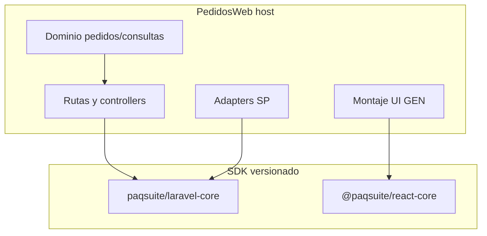

# Plan de adopción SDK Framework en PedidosWeb

**Estado:** borrador para análisis (no implementar hasta OK explícito).  
**Audiencia:** dueño de producto + programador.  
**Revisión:** 2026-08-24 (gobierna modo de cambio, OpenSpec y fuente de verdad).  
**Origen técnico:** 2026-08-17 (inventario GEN, fases, huecos, impacto por capa).  
**Producto:** PedidosWeb (`PAQSUITE_PROYECTO=pedidosweb`)  
**Tenancy:** `single` / `unified`  
**SDK de referencia:** `paqsuite/laravel-core` ^1.3.3 · `@paqsuite/react-core` ^2.2.1  

Este archivo **es** el plan vivo de adopción. El documento anterior (mismo path, 17/08) cubría el *cómo técnico*; esta revisión agrega *cómo gobernar* el trabajo para que el código final y la documentación coincidan.

Plan conceptual previo (extracción de un Framework *desde* PedidosWeb; **ya no aplica**): [`.cursor/plans/paqsuite-framework-compartido.plan.md`](../../.cursor/plans/paqsuite-framework-compartido.plan.md). El Framework ya existe y se consume por paquetes; PedidosWeb no es el donante.

---

## Cómo leer este documento

| Si querés… | Ir a |
|------------|------|
| La recomendación en una página | [Resumen ejecutivo](#resumen-ejecutivo) |
| Por qué no es un reemplazo integral ni un GEN aislado | [Modo de cambio](#1-modo-de-cambio--oleadas-no-big-bang) |
| Qué hacer con SPEC / HU / TR | [Estrategia OpenSpec](#2-estrategia-openspec--épica-nueva--updates-no-reescribir-el-histórico) |
| Cómo queda la documentación al final | [Fuente de verdad](#3-fuente-de-verdad-después-de-la-migración) |
| Qué GEN hay hoy y qué se adopta | [Inventario](#inventario-gen-actual-en-pedidosweb-sin-sdk) |
| Orden de implementación | [Oleadas y fases](#oleadas-y-fases-de-trabajo) |
| Riesgos, tests, bloqueos | [Riesgos](#riesgos) |

**Este documento no es un SPEC.** Tras el OK, el primer entregable OpenSpec es `SPEC-101-22` (épica de adopción). Hasta entonces no se toca código.

---

## Resumen ejecutivo

PedidosWeb es un host **maduro**: login, shell, menú, grillas, pivots, Excel, chat BYOK y mobile Capacitor (`v1.2.2-mobile`) están **reimplementados en este repo**. Aún **no** consume `paqsuite/laravel-core` ni `@paqsuite/react-core` (`composer.json` / `package.json` actuales no los declaran).

El trabajo **no** es un scaffold `create-app`. Es una migración tipo *strangler*: reemplazar el motor GEN local por montaje del SDK y **conservar el dominio PedidosWeb** (pedidos, presupuestos, visibilidad comercial, consultas, kardex, asistente de carga).

### Tres decisiones (recomendadas)

| Pregunta | Recomendación | Por qué |
|----------|---------------|---------|
| ¿Cambio integral o por componente? | **Oleadas** (grupos de GEN acoplados), no big-bang ni GEN suelto | Login/shell/envelope/tenancy no se pueden cortar en PRs independientes sin dual-UI; Excel/pivots/chat sí. Un único PR es inrevisable y no hay rollback limpio sobre `Ankas_del_sur`. |
| ¿Rehacer SPEC-HU-TR o updates? | **Épica nueva `SPEC-101-22`** + **updates** al histórico GEN; **no** reescribir SPEC-001/HU/TR cerrados | El histórico es la traza de cómo se construyó el producto. El motor vigente pasa a ser el Framework. Reescribir todo es meses de papel sin código y choca con la numeración distinta Framework vs PedidosWeb. |
| ¿Cómo queda la SoT al final? | **Tres capas:** Framework (motor) · host integración · host dominio | Un solo archivo no puede ser verdad de SDK *y* de reglas de pedidos. El README de Generalidades se convierte en **mapa de vigencia**, no en copia del Framework. |

### Qué no se discute en este plan

- Copiar carpetas GEN del Framework al producto (prohibido).
- Adoptar GEN diferidos o en redefinición (15, 24–30).
- Selector de empresas / grupos (solo `tenancy=multi`).
- Reescribir el dominio Eloquent de `pq_pedidosweb_*` “de paso”.
- DROP / bootstrap destructivo sobre `Ankas_del_sur`.

---

## 1. Modo de cambio — oleadas, no big-bang

### Por qué no integral (un solo corte)

- Base compartida (`Ankas_del_sur`): el reemplazo toca tenancy, envelope, menú, layouts, Excel, LLM. Un fallo mezcla estados irrecuperables sin DROP (prohibido).
- Mobile ya publicado (`v1.2.2-mobile`): el shell/auth SDK hay que recablear **después** de que web esté estable, no en el mismo merge.
- Colisiones reales: códigos envelope `3001`/`2001`, cliente `desarrollo` vs `DEMO`, esquemas GEN distintos (`pq_asistente_ia_*` vs `pq_llm_credentials`, etc.).
- Revisión: un PR de “reemplazar todo GEN” no es auditable por un programador.

### Por qué no “un GEN = un PR” aislado

Varios GEN **no son independientes en runtime**:

| Corte | GEN acoplados | Si se separan… |
|-------|---------------|----------------|
| Plataforma | 20 envelope + 19 tenancy + 04 login + 01/02/07/08 shell | Login SDK con shell viejo (dual CSS/testid) o envelope mixto (FE rompe parseo) |
| Grillas | 11 + `apiRequest` del core | `DataGridDx` SDK hablando con client local que tira throw |
| Chat | 16 BYOK + 21 chat | Chat SDK sin credenciales GEN |
| Smart Capture | 03 + 16 | Panel sin provider |

Un GEN “chico” (09 dashboard, 10 parámetros read-only, 12 pivots, 14 Excel) **sí** puede ser un PR después de la plataforma.

### Modelo recomendado: oleadas

Una **oleada** es un incremento desplegable, con criterio de hecho observable y (si hace falta) feature flag. Dentro de cada oleada hay **fases** técnicas (las del plan 17/08). El programador mergea por fase; producción recibe por oleada.

```text
Oleada A  plataforma     Fases 0 → 1 → 2     (envelope, tenancy, login, shell)
Oleada B  consultas UX   Fases 3 → 4         (admin seguridad, grillas/layouts)
Oleada C  capacidades    Fase 5 GEN a GEN    (16, 21, 12, 14, 09, 10, 13, 17, 03)
Oleada D  mobile         Fase 6              (recablear Capacitor al SDK)
```

Dominio PedidosWeb (pedidos, consultas, kardex, `CommercialProfileResolver`, asistente de carga con `actions`) **convive todo el tiempo**; no espera al final.

### Criterio para “cerrar una oleada”

- Código local GEN de esa oleada **borrado o reducido a wrapper** (no dos shells).
- Tests de la oleada verdes (PHPUnit + Vitest + 1 E2E).
- OpenSpec de la oleada: TR de `SPEC-101-22` en F + SPEC-updates del histórico tocado.
- Guía viva `docs/01-arquitectura/integracion-framework-sdk.md` actualizada (versión SDK, binds, huecos).
- Sin cambio funcional de dominio salvo el delta explícito de esa TR (p. ej. remap de códigos envelope).

### Feature flags

Solo oleada A justifica un flag de corte (`PAQSUITE_SDK_SHELL=0/1` o equivalente) si hace falta convivir una semana en el mismo deploy. Oleadas B–C se pueden mergear a `develop` por fase sin flag si cada fase es vertical (ruta + bind + UI + test). **No** mantener dual-UI de login/shell más de una oleada.

---

## 2. Estrategia OpenSpec — épica nueva + updates, no reescribir el histórico

### El problema de numeración (no ignorarlo)

Los `SPEC-001-xx` **de este repo** no coinciden con los GEN-xx del Framework. Ejemplo: PedidosWeb `SPEC-001-03` es grillas; Framework GEN-03 es Smart Capture. PedidosWeb `SPEC-001-10` es chat; Framework GEN-10 es ABM parámetros.

Por eso **está prohibido** “renumerar” o reescribir los SPEC-001 locales para que imiten al Framework. El mapa de vigencia (abajo) es el puente.

### Qué artefactos crear vs qué no tocar

| Artefacto | Acción | Motivo |
|-----------|--------|--------|
| SPEC / HU / TR `001-Generaliddes` **cerrados en F** | **No reescribir.** Tras cada oleada, **SPEC-update / HU-update / TR-update** con el delta de montaje SDK | Conservan decisiones, CC, `data-testid` históricos y cierres F. El update dice “el motor ahora es Framework GEN-xx; el host conserva [delta]”. |
| SPEC / HU / TR `101-PedidosWeb` de **dominio** | **No reescribir.** Update **solo** si cambia contrato visible (envelope, path, testid, tenant `DEMO`) | Pedidos, visibilidad, carga, mails, import masiva siguen siendo del producto. |
| **Nuevo** `SPEC-101-22-adopcion-sdk-framework` | **Crear** (Parte A/A1) | La migración *es* un cambio de producto. Un SPEC por oleada o un SPEC con slices A–D. |
| HU/TR de `SPEC-101-22` | **Una HU + una TR por fase** (o por oleada si se acuerda agrupar A) | AC de *sustitución*: monta export X, bind SP Y, borra duplicado local, tests verdes. **No** re-especifican login/grilla desde cero. |
| Capacidades **nuevas** en PedidosWeb (GEN-03, 13, 17) | **SPEC-HU-TR nuevos de producto**, plantilla “adoptar GEN-xx, no reimplementar” | No hay histórico que actualizar: es alcance nuevo. Pueden ser slices de 101-22 o SPEC 101-23… si el dueño prefiere épicas separadas. |
| SPEC Framework (`PaqSuite-IA-FRAMEWORK`) | **No copiar** al host. Citar. Si hay hueco, trabajo **upstream** | SoT del motor vive allá. |

### Contenido mínimo de `SPEC-101-22` (cuando se autorice)

Plantilla de enunciado (norma host):

```text
Adopción SDK en PedidosWeb: montar GEN-xx. UI/motor = [export]. No reimplementar.
SoT: Framework SPEC-001-xx. Host: [delta: CommercialProfileResolver, menú pq_menus,
consultaId, handler Excel pedidos, ChatCorpusProvider, actions de carga, kardex].
```

El SPEC de adopción debe listar, por oleada:

1. GEN que se montan y exports SDK.
2. Código local que se elimina (rutas de archivo).
3. Delta host que **permanece** (dominio).
4. Contratos que cambian (envelope, testids, paths, tenant).
5. Huecos Framework y parche temporal (como Partes).
6. Fuera de alcance (GEN-05/15/23/24–30, DROP, reescritura ERP).

### Orden OpenSpec vs código

```text
OK humano de este plan
  → A/A1  SPEC-101-22 (épica; slices = oleadas)
  → B/B1  HU por fase
  → C/C1  TR por fase
  → D1    plan de implementación de esa TR (este archivo alimenta D1, no lo sustituye)
  → D/E/F código + tests + verificación de ESA oleada
  → G     SPEC-update del histórico GEN tocado + volcado al mapa de vigencia
  → siguiente oleada
```

**No** generar las 20 TR de todas las oleadas el día 1. Cerrar OpenSpec de la oleada A, implementar A, documentar A, recién entonces B. Si se generan todas juntas, quedan obsoletas al primer hueco de Framework.

### Updates al histórico: qué escribir (y qué no)

Un SPEC-update de adopción **no** relata de nuevo la regla de negocio. Relata el **cambio de dueño del motor**:

```text
In scope (delta):
- Login UI = AuthLoginLayout / AuthCardLayout (@paqsuite/react-core).
- Envelope = PaqSuiteEnvelopeCatalog. Códigos host 3001/2001 remapeados a 5xxx.
- Conservar: CommercialProfileResolver, payload functionalProfile, loginTenant native.

Fuera de scope:
- Cambiar reglas de visibilidad vendedor/supervisor.
- ABM parámetros (GEN-10 PATCH).
```

Los AC de las TR históricas (`TR-GEN-02-login-sesion`, etc.) **siguen valiendo como comportamiento esperado**, salvo el delta del update. El programador no reimplementa login; verifica paridad.

---

## 3. Fuente de verdad después de la migración

Objetivo: que un programador nuevo sepa **dónde mirar** sin leer tres copias contradictorias del mismo login.

### Tres capas (obligatorias)

```text
┌──────────────────────────────────────────────────────────────┐
│ 1. Framework (PaqSuite-IA-FRAMEWORK + paquetes versionados)  │
│    SoT del MOTOR GEN: SPEC-001-xx del Framework, código SDK, │
│    guías de adopción, catálogo envelope, exports UI.         │
└──────────────────────────────────────────────────────────────┘
                         ▲ consume semver
┌──────────────────────────────────────────────────────────────┐
│ 2. Host — integración (este repo)                            │
│    docs/01-arquitectura/integracion-framework-sdk.md         │
│    Versión composer/npm, binds SP, flags, huecos, parches,   │
│    mapa GEN Framework ↔ archivo host ↔ SPEC local.           │
└──────────────────────────────────────────────────────────────┘
                         ▲
┌──────────────────────────────────────────────────────────────┐
│ 3. Host — dominio (este repo)                                │
│    SPEC-101-xx + docs/02-producto/PedidosWeb/*               │
│    Pedidos, visibilidad, carga, consultas, mails, mobile     │
│    policy, kardex, asistente de carga (actions).             │
└──────────────────────────────────────────────────────────────┘
```

**Regla de conflicto:** motor GEN → gana Framework. Delta de montaje → gana `integracion-framework-sdk.md`. Regla de negocio PedidosWeb → gana `docs/02-producto` / SPEC-101. Si los tres discrepan, es un bug de documentación de la oleada, no se “arregla” copiando el SDK al SPEC-001 local.

### Qué pasa con `docs/05-open-spec/001-Generaliddes/`

No se borra. Se **reetiqueta**:

1. Banner al inicio de cada SPEC-001 local: *histórico pre-SDK; vigencia = Framework GEN-xx + delta en integración / SPEC-update*.
2. El [README de Generalidades](../05-open-spec/001-Generaliddes/README.md) pasa a ser el **mapa de vigencia** (tabla de la sección siguiente, actualizada en cada Parte G).
3. Los updates viven en `docs/05-open-spec/updates/001-Generaliddes/` como hasta ahora (Parte G).

Así el histórico sigue auditable (CC, cierres F) y deja de pretender ser el contrato del motor.

### Qué se crea en el host (no existe hoy)

| Documento | Rol |
|-----------|-----|
| `docs/01-arquitectura/integracion-framework-sdk.md` | Guía viva (estilo Partes). Se crea en oleada A fase 0 y se actualiza **en cada fase**. |
| `SPEC-101-22` + HU/TR | Contrato de la migración. |
| Mapa en README `001-Generaliddes` | Puente numeración local ↔ GEN Framework. |

### Qué no se duplica

- No copiar SPEC Framework al host.
- No reescribir el manual de usuario para hablar de SDK; solo si cambia UX visible (textos, flujos). Corpus del asistente = dominio.
- No versionar “PedidosWeb SPEC-001 = Framework SPEC-001”: son árboles distintos.

### Cierre documental global (después de oleada D)

Una única Parte G de consolidación:

1. Mapa de vigencia al 100 % (todas las filas en `adoptado` / `no aplica` / `hueco documentado`).
2. `integracion-framework-sdk.md` con versiones lockfile y lista de SP locales vs upstream.
3. Índice SPEC-101-22 en estado F.
4. Manual de usuario: diff UX real, si hubo.
5. Aviso de deploy (migrate no destructivo, SP, Satis/Verdaccio, smoke).

Hasta esa consolidación, la verdad “del día” es: **TR de la oleada en curso + guía de integración + mapa**.

---

## Mapa de vigencia (SPEC local → GEN Framework)

Usar **siempre** el nombre `GEN-xx Framework`. Actualizar la columna *Estado adopción* en cada Parte G.

| SPEC PedidosWeb (histórico) | Tema local | GEN Framework | Estrategia OpenSpec | Estado adopción (hoy) |
|-----------------------------|------------|---------------|---------------------|------------------------|
| SPEC-001-01 | Experiencia base (tema, i18n, menú, avatar) | 01, 02, 07, 08 | Update post oleada A | local, sin SDK |
| SPEC-001-02 | Acceso y seguridad / login | 04, 20 | Update post oleada A (remap envelope) | local, sin SDK |
| SPEC-001-02-admin | ABM roles/permisos | 06 | Update post oleada B | local, flag `ADMIN_SECURITY_UI_ENABLED` |
| SPEC-001-03 | UI transversal / grillas | 11 | Update post oleada B | local `DataGridDx` |
| SPEC-001-04 | Parámetros | 10 | Update: **consulta only, sin PATCH** | parcial (ERP read-only) |
| SPEC-001-05 | Variantes / tenancy MONO | 19 | Update post oleada A; alinea SPEC-101-01 | stub `paq.tenant` / allowlist |
| SPEC-001-06 | Emisión | 15 | **No adoptar** (Framework en redefinir) | documental |
| SPEC-001-07 | Importar Excel | 14 | Update post oleada C | local, acoplado a pedidos |
| SPEC-001-08 | Pivots | 12 | Update post oleada C | local, flags env |
| SPEC-001-09 | Tareas programadas | 13 | **SPEC/HU/TR nuevos** (capacidad nueva) | documental |
| SPEC-001-10 | Chat / BYOK | 16, 21 | Update post oleada C; `actions` de carga = dominio 101-18…20 | local tablas `pq_asistente_ia_*` |
| SPEC-001-11 | Mobile Capacitor MONO | 22 | Update post oleada D | implementado local `v1.2.2-mobile` |
| SPEC-101-01 | Backend `EMPRESAS_CONEXION` | 19 | Entra en oleada A (estaba diferido) | etapa posterior |
| SPEC-101-09 | Frontend base | 01, 19 | Update testids canónicos SDK | local |
| SPEC-101-11 | Consultas UI | 11, 12 | Update al montar DataGrid/Pivot SDK | local |
| SPEC-101-14 | Dashboard | 09 | Update: `DashboardContainer` + widgets host | local KPIs |
| SPEC-101-16 / 21 | Excel pedidos | 14 | Update handler host; no rehacer parser | dominio host |
| SPEC-101-17 | Mobile PedidosWeb | 22 | Update recable policy/kardex | local |
| SPEC-101-18…20 | Asistente carga (`actions`) | — (hueco vs GEN-21 `/turns`) | **No sustituir** por chat GEN; dominio host | local |
| *(no existe)* | Smart Capture | 03 | SPEC/HU/TR nuevos en oleada C | ausente |
| *(no existe)* | Auditoría / bandeja | 17 | SPEC/HU/TR nuevos en oleada C | ausente |
| — | Selector empresas | 05 | N/A (`tenancy=single`) | no aplica |
| — | Grupos empresarios | 23 | N/A (`tenancy=multi`) | no aplica |
| — | GEN 24–30 | 24–30 | Diferidos; no inventar | fuera |

---

## Qué confirmar antes de ejecutar

- [ ] Lookup instalación: cliente canónico `DEMO` + `EMPRESAS_CONEXION` (opción A: valida fila, sigue `DB_*` / Ankas). Tests pasan de `desarrollo` a `DEMO`.
- [ ] Envelope: adoptar catálogo del SDK; remapear códigos PedidosWeb que colisionan (`3001` / `2001`) a un rango host (p. ej. 5xxx).
- [ ] GEN-10: **no** ABM; parámetros ERP siguen de solo lectura.
- [ ] GEN-03 / 13 / 17: entrar en oleada C como capacidades **nuevas**, después de reemplazar GEN ya existente.
- [ ] Acceso Tailscale a Satis (`http://100.110.69.93/satis`) y Verdaccio (`http://100.110.69.93:4873`) en el puesto y en Forge/CI.
- [ ] Permiso para `CREATE/ALTER PROCEDURE` en operativa **sin** DROP / bootstrap destructivo.
- [ ] OK al modo oleadas + `SPEC-101-22` + updates (este documento). Número de SPEC 101-22 libre; si el índice 101 ya usó 22, usar el siguiente ID libre.

---

## Alcance entendido

Contrato a respetar (sin copiar carpetas GEN):

- Overrides: `PaqSuite-IA-FRAMEWORK/docs/10-overrides-framework/`
- Guía: `PaqSuite-IA-FRAMEWORK/docs/00-Conceptualizacion/04-guias/COMO_USAR_EL_FRAMEWORK_DESDE_UN_PROYECTO.md` + aclaraciones `…-PQ.md` §9.1
- Host vs Framework / publish / deploy: `PaqSuite-IA-FRAMEWORK/MANUAL-DEL-PROGRAMADOR.md` §4–§7
- Cableado: `apps/smoke-backend` + `apps/smoke-frontend` (plantilla; **Eloquent solo smoke**)
- Host de referencia ya adoptado: Partes (`docs/01-arquitectura/integracion-framework-sdk.md`, Fase 1–2)
- Norma diaria en este repo: `.cursor/rules/base/00-arquitectura/19-framework-gen-capacidades-adopcion.mdc`

Distribución: Satis + Verdaccio (Tailscale). **Prohibido** path/`file:` al monorepo Framework en Git.



---

## Inventario GEN actual en PedidosWeb (sin SDK)

Hoy **no** hay paquetes PaqSuite. Toda capacidad GEN está copiada en el producto.

| GEN Framework | Tema | Estado local PedidosWeb | Notas |
|---------------|------|-------------------------|-------|
| 01 | Estética UI | implementado | `ShellLayout` local; no hay `AuthLoginLayout` SDK |
| 02 | i18n | implementado | `LocaleSelector`; 5 locales es/en/pt/fr/it (alineado) |
| 03 | Smart Capture | ausente | Capacidad nueva si se adopta |
| 04 | Login | implementado | Sanctum + `CommercialProfileResolver` (dominio host) |
| 05 | Selector empresas | N/A | `tenancy=single` |
| 06 | Admin seguridad | implementado | Flag `ADMIN_SECURITY_UI_ENABLED` |
| 07 | Menú | implementado | `pq_menus` Eloquent |
| 08 | Menú avatar | implementado | `AvatarMenu` |
| 09 | Dashboard | implementado | KPIs host, no `DashboardContainer` |
| 10 | Parámetros | parcial | Solo consulta; norma producto = ERP read-only |
| 11 | Grillas/layouts | implementado | `DataGridDx` + `/grid-layouts` |
| 12 | Pivots | implementado | Flags env; excluido mobile |
| 13 | Tareas programadas | ausente | SPEC local documental |
| 14 | Import Excel | implementado | Acoplado a carga pedidos; excluido mobile |
| 15 | Emisiones | ausente | Framework en **redefinir**; no adoptar |
| 16 | BYOK LLM | implementado | Tablas `pq_asistente_ia_*`, no `pq_llm_credentials` |
| 17 | Auditoría / bandeja | ausente | Capacidad nueva si se adopta |
| 18 | Install/update | parcial | `seed-deploy` + migrate; no pipeline GEN-18 |
| 19 | Shell/tenancy | implementado | Allowlist `TENANT_ALLOWED_CLIENTS` (`desarrollo`), no `EMPRESAS_CONEXION` |
| 20 | Envelope API | implementado | Misma forma JSON; **códigos enteros chocan** |
| 21 | Chat / ayuda | implementado | `POST /chat-assistant/messages` + `actions` (hueco vs `/turns`) |
| 22 | Mobile Capacitor | implementado | `v1.2.2-mobile` |
| 23 | Grupos empresarios | N/A | Solo `multi` |

Acceso a datos GEN hoy: **Eloquent / Query Builder**. Cero SP desplegados. Dominio PedidosWeb: Eloquent + SQL crudo puntual.

---

## Fuera de alcance (no inventar)

| Ítem | Motivo |
|------|--------|
| GEN-05 UI selector empresas | `tenancy=single`: 1 empresa; no pedir selector. Middleware **inyecta** `X-Company-Id` de la única fila. |
| GEN-23 Grupos empresarios | Solo `tenancy=multi`. |
| GEN-15 Emisiones | Estado Framework **redefinir** (`15-reportes-emisiones-update.md`). Smoke = fakes. Comunicación = GEN-30 (diferido). |
| GEN-24 a GEN-30 | Diferidos (sin exports o no listos). |
| Copiar GEN del Framework al producto | Norma explícita. Si falta contrato → señalar hueco / aportar al Framework. |
| Adapters Eloquent del smoke en prod | MUST SP. |
| DROP/TRUNCATE en `Ankas_del_sur` | Regla de consentimiento; deploy SP = `CREATE/ALTER PROCEDURE` idempotente, sin bootstrap destructivo. |
| Reescribir SPEC-001/HU/TR históricos | Ver [estrategia OpenSpec](#2-estrategia-openspec--épica-nueva--updates-no-reescribir-el-histórico). |
| Big-bang de todas las oleadas en un PR | Ver [modo de cambio](#1-modo-de-cambio--oleadas-no-big-bang). |

---

## Huecos del Framework (señalar, no inventar)

Estos **no** se “arreglan” en PedidosWeb inventando contratos. Se documentan en la guía de integración y, si bloquean una oleada, se abre trabajo en Framework **o** se replica el parche local ya usado en Partes (con nota de upstream).

1. **No hay adapters PHP SP en `laravel-core`** (salvo tenancy `SqlInstalacionResolver`). El host implementa `App\Repositories\Sp\*` + `SpCaller` (patrón Partes).
2. **`UserPreferencesRepository`** pide `locale` + `openInNewTab` + `activeLlmCredentialId`; SP upstream solo `pq_sp_user_locale_get/set`. Partes añadió `pq_sp_user_preferences_*` local.
3. **GEN-11:** `GridLayoutsController` del smoke usa Eloquent directo; **no existen** `pq_sp_grid_layout_*` en `database/sp/`.
4. **Esquema `pq_empresa` vs `pq_empresas`:** Partes reportó drift en SP de empresas; verificar scripts 1.3.3 antes de A1. PedidosWeb hoy **no** tiene esa tabla de empresa GEN.
5. **DDL GEN distinto** al de PedidosWeb: `pq_menus` (columnas), grid layouts (`user_id` vs `created_by_user_id`), Excel (`pq_excel_batches` vs `pq_excel_importaciones*`), LLM (`pq_llm_credentials` vs `pq_asistente_ia_*`), parámetros (`pq_parametros_gral` vs `PQ_parametros_gral`).
6. **Catálogo envelope:** Framework `3001` = unauthenticated; PedidosWeb `3001` = `noCommercialProfile`, `2001` = invalidCredentials. **No redefinir** `PaqSuiteEnvelopeCatalog`. El host debe **remapear** códigos de dominio a un rango libre (p. ej. 5xxx) y actualizar FE/tests.
7. **Chat:** canónico `POST /chat-assistant/turns`; PedidosWeb `POST /chat-assistant/messages` + `actions` de carga. El contrato GEN **no** incluye `actions`. Conservar carga-asistente como **dominio host** (SPEC-101-18…20) hasta que Framework cubra ese hueco.
8. **GEN-10 ABM** (`PATCH /parametros/{clave}`) contradice la norma PedidosWeb (parámetros ERP de **solo lectura**). No montar edición; consulta sí.
9. **Login comercial** (`CommercialProfileResolver` + `pq_pedidosweb_login`) es **dominio host** (override tenancy: *gate de negocio post-login = extensión del producto*). Usar `PostLoginBusinessGate` del host; no pedirlo al SDK.

---

## Decisiones recomendadas (confirmar al ejecutar)

- **Modo:** oleadas A→D; merge interno por fase; no big-bang.
- **OpenSpec:** `SPEC-101-22` + updates; no reescritura del histórico GEN.
- **Lookup instalación:** `PAQSUITE_INSTALACION_RESOLVER=sql` contra `PAQSYSTEMS.EMPRESAS_CONEXION` + fila `DEMO|pedidosweb`. Arranque **opción A** (middleware valida fila; la app sigue en `DB_*` / Ankas). PHPUnit: `resolver=config`. Tests/E2E pasan de `X-Paq-Cliente: desarrollo` a `DEMO` (normalizador uppercase).
- **Envelope:** adoptar `ApiResponse` / `PaqSuiteEnvelopeCatalog` del SDK en rutas GEN; códigos PedidosWeb que colisionan se remapean en el host.
- **GEN-10:** no adoptar ABM; mantener consulta read-only (página host o `ParametrosGeneralesPage` sin PATCH).
- **GEN-03 / 13 / 17:** sí entran (están *listo*), pero **después** de 04/01/07/11/16; son capacidades **nuevas** en PedidosWeb, no un reemplazo 1:1.

---

## Impacto esperado

### Base de datos

- Publicar/adaptar migraciones smoke `000001`–`000014` **solo columnas/tablas GEN faltantes** (`open_in_new_tab`, `active_llm_credential_id`, `pq_llm_credentials`, tasks, audit, notifications, excel GEN, etc.). Sin `migrate:fresh`.
- Deploy SP desde `vendor/paqsuite/laravel-core/database/sp/*.sql` en BD operativa **y** `pq_sp_empresas_conexion_get` en `PAQSYSTEMS`.
- Seed fila `EMPRESAS_CONEXION` `cliente=DEMO`, `proyecto=pedidosweb`.
- Tabla empresa única (`pq_empresa` / equivalente) para A1 tema; ABM: no borrar el único registro.
- **No** migrar tablas de dominio `pq_pedidosweb_*`.

### Backend

- [`backend/composer.json`](../../backend/composer.json): Satis + `"paqsuite/laravel-core": "^1.3.3"` + `secure-http: false`.
- `php artisan vendor:publish --tag=paqsuite-config`; completar [`backend/config/paqsuite.php`](../../backend/config/paqsuite.php): `proyecto`, `instalacion`, `instalaciones`, `companyHeaderAllowlist`.
- `.env.example`: `PAQSUITE_PROYECTO=pedidosweb`, `PAQSUITE_INSTALACION_RESOLVER`, `PAQSUITE_CENTRAL_*`.
- Registrar aliases `PaqSuiteCoreServiceProvider::tenancyMiddlewareAliases()`; sustituir `paq.tenant` / `ValidatePaqTenant` por `paqsuite.instalacion`.
- Providers host (patrón smoke/Partes): binds de **todas** las interfaces GEN de la fase hacia `Sp*`, **nunca** `Eloquent*` de smoke. Conservar `PedidosWebServiceProvider` de dominio.
- Rutas: patrón smoke `routes/api.php` + `capabilities.php` **por fase**. Controllers en el host; envelope del core.
- Auth: Sanctum sigue siendo excepción documentada (Eloquent `User`). Gate comercial host.
- OpenAPI: sigue siendo del host (L5-Swagger); reanotar rutas GEN al cambiar paths.

### Frontend

- [`frontend/package.json`](../../frontend/package.json) + `frontend/.npmrc`: `"@paqsuite/react-core": "^2.2.1"`.
- [`frontend/src/main.tsx`](../../frontend/src/main.tsx): `auth.css` + `shell.css` **después** de DX; no redefinir `.pqAuth*` / `.pqShell*`.
- Reemplazar GEN local por exports SDK: `AuthLoginLayout`, `AuthCardLayout`, `ShellLayout`, `MenuSidebar`, `UserAvatarMenu`, `LanguageSelector`, `DataGridDx`, `apiRequest` (`ApiClientResult`, no throw).
- Conservar `features/pedidos/**`, consultas, kardex, `pedidosWebMobilePolicy`.
- i18n: merge namespaces GEN (`login.*`, `menu.*`, envelope `respuesta`, 5 locales ya alineados). El paquete **no** trae JSON.
- `data-testid`: alinear a canónicos SDK (`loginUsuario`, `loginSubmit`, `authLoginPage`) y actualizar E2E.
- Mobile: re-cablear `isNativeApp()` / `MobileConfigPanel` / `MobileRouteGuard` del SDK **sin** perder policy PedidosWeb ni kardex.

### Tests

Por fase: PHPUnit feature del host (tenant `DEMO`, envelope catálogo) + Vitest de wrappers + Playwright smoke (login + 1 pantalla). No copiar la suite Eloquent del smoke.

### Documentación (por oleada, no “al final de todo”)

Cada oleada cierra con:

1. Guía viva `docs/01-arquitectura/integracion-framework-sdk.md` (versión SDK, fases hechas, huecos, SP locales).
2. SPEC-update / HU-update / TR-update del histórico tocado.
3. Avance del mapa de vigencia (README Generalidades).
4. Cierre F de la TR de `SPEC-101-22` de esa fase.

Al terminar oleada D: consolidación Parte G (sección 3).

No reescribir SPEC-001 PedidosWeb para “detectar” GEN: el inventario de capacidades vive en el Framework (§9.1 PQ); el host solo mapea.

### DevOps

- Forge: `composer install` contra Satis; **sin** clone del monorepo. Acceso Tailscale a `100.110.69.93:80`.
- FE/CI: Verdaccio + `.npmrc`.
- Post-deploy: migrate no destructivo + sqlcmd de SP nuevos + smoke health/login.

---

## Oleadas y fases de trabajo

Criterio técnico: guía Framework §6. Cada **fase** = binds SP + rutas host + montaje FE **solo de esa fase** + tests + doc. No encender el resto.

Criterio de entrega: el usuario ve un corte estable al cerrar la **oleada**.

### Oleada A — Plataforma (Fases 0–2)

Cortar junta en producción (o detrás de un flag). Dual login/shell no debe quedar en `develop` más de una fase.

#### Fase 0 — Base (dependencias, tenancy, envelope, health)

- Acceso Tailscale + login Verdaccio + Satis.
- Instalar paquetes; publish config; `PAQSUITE_PROYECTO=pedidosweb`.
- Crear `docs/01-arquitectura/integracion-framework-sdk.md` (esqueleto).
- `InstalacionResolver` SQL (opción A) + fallback config; health `GET /api/v1/health`.
- Introducir `ApiResponse` del core **en paralelo** (capa de adaptación) hasta remapear códigos.
- **Done:** health 200; cliente inválido → envelope `1001`; sin cambio funcional de pantallas.
- **OpenSpec:** slice A0 de 101-22; update SPEC-001-05 / SPEC-101-01.

#### Fase 1 — GEN-04 login / sesión / passwords

- Rutas auth del smoke; Sanctum + `PostLoginBusinessGate` = `CommercialProfileResolver` (host).
- FE: `AuthLoginLayout` / `AuthCardLayout` + i18n `login.*` + `loginTenant` native (ya existe).
- Conservar payload de sesión PedidosWeb (`functionalProfile`, timeouts) **extendiendo** el resultado host, no pidiendo al SDK un contrato nuevo.
- **Done:** login cliente/vendedor + 403 sin perfil; forgot/reset/change-password.
- **OpenSpec:** slice A1; update SPEC-001-02.

#### Fase 2 — GEN-01/02/07/08/19 shell + i18n + menú + avatar

- `ShellLayout` + `MenuSidebar` + `UserAvatarMenu` + `LanguageSelector`; CSS `shell.css`.
- Binds SP: `MenuQueryRepository`, `UserPreferencesRepository` (locale; preferences extendidas = hueco 2).
- `GET /user/menu`, `GET/PATCH /user/preferences`.
- Single: **no** `EmpresaSelectorPage`; inyectar empresa única (A1 `applyEmpresaAppearance` cuando exista `pq_empresa.theme`).
- Borrar layouts auth/shell locales duplicados.
- **Done:** navegar menú MVP PedidosWeb; locale/theme; footer testids canónicos.
- **OpenSpec:** slice A2; update SPEC-001-01; Parte G del mapa (fila 01/02/04/07/08/19/20).

### Oleada B — Admin + grillas (Fases 3–4)

PRs secuenciales; cada uno desplegable.

#### Fase 3 — GEN-06 admin seguridad

- Sustituir ABM local por contratos `UserAdminRepository` / roles / permisos + SP `pq_sp_admin_*`.
- Flag `ADMIN_SECURITY_UI_ENABLED` / `paqsuite.seguridadAdmin` se mantiene.
- Excluido mobile (ya en policy).
- **Done:** roles/permisos con envelope GEN; E2E admin.
- **OpenSpec:** update SPEC-001-02-admin.

#### Fase 4 — GEN-11 grillas / layouts

- Montar `DataGridDx` / `ProcessDataGrid` + `useGridLayouts` del SDK en consultas web.
- **Hueco SP grid-layouts:** no inventar firma; o aportar SP al Framework o documentar adapter temporal y abrir upstream.
- Kardex mobile **no** usa DataGrid desktop (GEN-22).
- **Done:** una consulta (p. ej. stock) + persistencia de layout; luego el resto de consultas web.
- **OpenSpec:** update SPEC-001-03 y SPEC-101-11 (testid / export si cambia).

### Oleada C — Capacidades listo (Fase 5, un GEN por PR)

Orden interno sugerido. Cada ítem = TR propia de 101-22 (o SPEC 101-23+ si se separan las capacidades nuevas).

1. **GEN-16 BYOK** — migrate `pq_llm_credentials` + 7 SP `pq_sp_llm_*` (`adopcion-gen-16-byok.md`). Migrar datos desde `pq_asistente_ia_*` si hace falta (script host, no DROP). UI: `LlmPreferencesPanel`. Update SPEC-001-10.
2. **GEN-21 Chat** — `ChatAssistantPage` + `POST /chat-assistant/turns` + `ChatCorpusProvider` **host** (manual PedidosWeb). Conservar carga-asistente (`actions`) como flujo dominio (101-18…20) hasta hueco 7.
3. **GEN-12 Pivots** — `ConsultaGrillaPivotShell` / `PivotGridBlock`; catálogo host (`consultaId` informes PedidosWeb); excluido mobile. Update SPEC-001-08 / 101-11.
4. **GEN-14 Excel** — `ExcelImportToolbar` + handler host de pedidos (no rehacer parser). Staging hacia contrato `pq_excel_batches` o adapter; **excluido mobile**. Update SPEC-001-07 / 101-16 / 101-21.
5. **GEN-09** — `DashboardContainer` + widgets que envuelven `DashboardOperativoService` (KPIs siguen siendo del producto). Update SPEC-101-14.
6. **GEN-10** — consulta read-only; **sin PATCH**. Update SPEC-001-04.
7. **GEN-13 Tareas** — **épica nueva** (no había producto). Páginas `/tareas-programadas/*` + `TaskProcessRegistry` (handlers host: p. ej. `EXCEL_IMPORT_BATCH` si GEN-14). Cron `tasks:run-due`.
8. **GEN-17** — **épica nueva.** `AuditEventsPage` + `NotificationsBell`. Mail dirigido → GEN-30 (no SMTP paralelo).
9. **GEN-03 Smart Capture** — **épica nueva.** `SmartCapturePanel` bajo un form host (carga pedido es el caso de referencia del Framework). Prereq GEN-16. No reemplazar en silencio el asistente de carga.
10. **GEN-18 ops** — runbook install/update: SP + seed menú GEN + fila `EMPRESAS_CONEXION`. No sustituir bootstrap PedidosWeb de tablas ERP.

### Oleada D — GEN-22 mobile (Fase 6)

Capacitor **ya está** (`v1.2.2-mobile`). Esta oleada es re-cablear shell/auth/config al SDK, preservar `pedidosWebMobilePolicy`, kardex, exclusiones (pivot/excel/admin/`openInNewTab`), y `npm run build:mobile` + `cap sync`.

**OpenSpec:** update SPEC-001-11 y SPEC-101-17. Smoke dispositivo físico antes de tag.

### Dominio PedidosWeb (todo el tiempo)

No se mueve al SDK: pedidos, presupuestos, artículos, consultas, `CommercialProfileResolver`, visibilidad vendedor, integración ERP, asistente de carga con `actions`. Acceso de negocio nuevo: SP (regla BASE); el legado Eloquent de dominio **no** se reescribe en este plan salvo que una fase GEN lo toque.

---

## Riesgos

| Riesgo | Mitigación |
|--------|------------|
| Big-bang rompe prod/Ankas | Oleadas; feature flag solo en A; no DROP; opción A de instalación |
| Colisión envelope 3001/2001 | Remap host + tests; no tocar catálogo SDK |
| Tenant `desarrollo` vs `DEMO` | Fila EMPRESAS_CONEXION + actualizar tests; documentar clientes reales |
| Dual UI (shell/login) durante transición | Oleada A completa antes de prod; no mezclar `AuthPageLayout` deprecated |
| Excel/chat/pivots esquema distinto | Adapter + migración de datos; no asumir rename |
| Mobile APK | Oleada D explícita; smoke dispositivo |
| Hueco SP grid-layouts / preferences | Documentar en guía de integración; parche host como Partes; upstream Framework |
| Numeración SPEC-001 PedidosWeb ≠ GEN-xx Framework | Mapa de vigencia; en docs del host nombrar **GEN-xx Framework** |
| Docs y código divergen a mitad de migración | Parte G **por oleada**, no un único volcado al final |
| Reescribir 80 TR GEN “para alinear” | Prohibido; updates de delta; épica 101-22 para el trabajo nuevo |
| Capacidades nuevas (03/13/17) se cuelan como “reemplazo” | OpenSpec propio; no silenciar el asistente de carga |

---

## Tests a ejecutar (por fase, mínimo)

- Fase 0: health + tenant inválido `1001`.
- Fase 1: `AuthLoginTest` (perfiles) + E2E login/forgot.
- Fase 2: `UserMenuTest` + E2E sidebar/avatar/locale.
- Fase 4+: 1 feature + 1 E2E de la capacidad montada.
- Tras FE `apiRequest`: actualizar ~35 módulos y `client.test.ts` a `ApiClientResult`.
- Regresión mobile policy: `pedidosWebMobilePolicy.test.ts`.
- Oleada D: smoke nativo además de web.
- No correr bootstrap destructivo.

---

## Dudas / bloqueos (antes de Fase 0)

- Acceso Tailscale a Satis/Verdaccio en el puesto y en Forge/CI.
- Existencia de BD `PAQSYSTEMS` + permiso para `CREATE PROCEDURE` en operativa (sin DROP).
- Confirmación del remap de códigos envelope y del cliente canónico `DEMO`.
- Confirmación del ID OpenSpec (`SPEC-101-22` u otro libre).
- GEN-15 y GEN-30: no implementar.

---

## Confirmación de alcance

- Sin copiar GEN; sin redefinir contratos SDK; sin capacidades diferidas; sin selector empresas ni grupos en `single`.
- Sí: todas las GEN **listo** aplicables a PedidosWeb single, **por oleadas**, con dominio PedidosWeb intacto y binds SP en el host.
- Ampliación funcional real (03/13/17) queda **después** de reemplazar GEN ya existente (04/01/07/11/16/21/12/14/22).
- OpenSpec: épica nueva de adopción + updates; histórico GEN no se reescribe.
- Documentación final: tres capas SoT + mapa de vigencia + guía de integración.

---

## Checklist de implementación (tras confirmar OpenSpec oleada A)

- [ ] Parte A/A1 de `SPEC-101-22` (slices = oleadas)
- [ ] Oleada A — Fase 0 SDK + tenancy + health + guía de integración
- [ ] Oleada A — Fase 1 GEN-04 login
- [ ] Oleada A — Fase 2 shell / i18n / menú / avatar + Parte G mapa
- [ ] Oleada B — Fase 3 GEN-06 admin
- [ ] Oleada B — Fase 4 GEN-11 grillas
- [ ] Oleada C — capacidades (16→21→12→14→09, 10 lectura, 13/17/03)
- [ ] Oleada D — GEN-22 mobile
- [ ] Consolidación documental (versiones SDK, huecos upstream, SP locales, mapa 100 %)

---

## Preguntas para cerrar con el programador

Respuestas cortas; con eso se puede abrir `SPEC-101-22`.

1. ¿Acuerdan oleadas A–D (no big-bang, no GEN suelto en plataforma)?
2. ¿Acuerdan no reescribir el histórico GEN y usar épica 101-22 + updates?
3. ¿GEN-03 / 13 / 17 entran en C, o se postergan a otro trimestre?
4. ¿Cliente canónico `DEMO` y remap envelope a 5xxx?
5. ¿Hay Tailscale/Satis/Verdaccio y `PAQSYSTEMS` para Fase 0?

Si 1–2 son sí, el siguiente paso **no** es código: es Parte A de `SPEC-101-22`.
