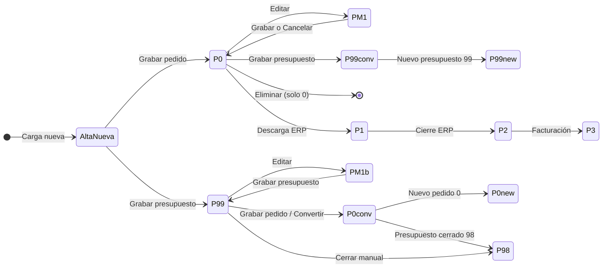

# PedidosWeb — Circuito de comprobantes y estados

| Campo | Valor |
|-------|--------|
| **Versión documento** | 2026-06-22 |
| **Ámbito** | Pedidos y presupuestos: estados, transiciones, conversiones, bloqueos |
| **Manual principal** | [PedidosWeb.md](./PedidosWeb.md) |
| **Validaciones** | [PedidosWeb-validaciones-errores.md](./PedidosWeb-validaciones-errores.md) |

---

## 1. Propósito

Este documento describe el **ciclo de vida** de pedidos y presupuestos en PedidosWeb: qué significa cada estado, qué acciones están permitidas, cómo funcionan las conversiones y cuándo un comprobante queda bloqueado para edición.

Úselo cuando la pregunta sea del tipo: «¿por qué mi pedido pasó a pendiente?», «¿puedo editar un presupuesto cerrado?», «¿qué pasa si convierto presupuesto a pedido?».

---

## 2. Estados de pedido

| Código | Nombre habitual | Descripción |
|--------|-----------------|-------------|
| **-1** | En modificación | Un usuario abrió el pedido en **Editar**. Bloquea la edición concurrente mientras dure la sesión activa (ver §5). |
| **0** | Ingresado | Pedido grabado y disponible para seguimiento, edición o conversión a presupuesto (según permisos). |
| **1** | Pendiente ERP | El ERP lo tomó en cartera comercial. **No editable** desde el portal en el MVP. |
| **2** | Cerrado ERP | Procesado o cerrado en el ERP. Solo consulta / copia. |
| **3** | Facturado | Facturado en el ERP. Solo consulta / copia. |

### Qué puede hacer el usuario según estado (pedido)

| Estado | Ver | Editar | Eliminar | Copiar | Convertir a presupuesto |
|--------|-----|--------|----------|--------|-------------------------|
| **-1** | Sí (quien edita) | Sí (sesión activa) | No | Según permisos | No (debe grabar o cancelar primero) |
| **0** | Sí | Sí* | Sí* | Sí | Sí* |
| **1** | Sí | No | No | Sí | No |
| **2** | Sí | No | No | Sí | No |
| **3** | Sí | No | No | Sí | No |

\*Sujeto a permisos de menú y parámetros globales *Impide modificar pedidos* / *Impide eliminar pedidos* (ver [PedidosWeb §13](./PedidosWeb.md#13-permisos-y-visibilidad)).

---

## 3. Estados de presupuesto

| Código | Nombre habitual | Descripción |
|--------|-----------------|-------------|
| **99** | Presupuesto activo | Vigente; editable según permisos. Puede convertirse a pedido o cerrarse manualmente. |
| **98** | Presupuesto cerrado | Cerrado por conversión exitosa, cierre manual con motivo u otro motivo de cierre ERP. **No editable** como activo. |

### Qué puede hacer el usuario según estado (presupuesto)

| Estado | Ver | Editar | Copiar | Convertir a pedido | Cerrar manualmente |
|--------|-----|--------|--------|--------------------|--------------------|
| **99** | Sí | Sí* | Sí | Sí* | Sí* |
| **98** | Sí | No | Sí | No | No |

\*Sujeto a permisos y parámetro *Impide modificar pedidos* (afecta también presupuestos activos).

---

## 4. Matriz de grabación (pedido vs presupuesto)

Al pulsar **Grabar pedido** o **Grabar presupuesto**, el sistema aplica esta lógica según el origen:

| Situación de partida | Acción del usuario | Resultado |
|----------------------|-------------------|-----------|
| **Alta nueva** (sin comprobante previo) | Grabar pedido | Pedido nuevo estado **0** |
| **Alta nueva** | Grabar presupuesto | Presupuesto nuevo estado **99** |
| **Pedido ingresado (0)** o **en modificación (-1)** | Grabar pedido | Mismo pedido, vuelve a estado **0**; sale de -1 |
| **Presupuesto activo (99)** | Grabar presupuesto | Mismo presupuesto, sigue en **99** |
| **Pedido ingresado (0)** | Grabar presupuesto | Presupuesto **nuevo 99**; el pedido origen **deja de existir** como ingresado |
| **Presupuesto activo (99)** | Grabar pedido | Pedido **nuevo 0**; presupuesto pasa a **98** con cierre automático por conversión |

### Diferencia entre Copiar y Convertir

| Acción | Efecto |
|--------|--------|
| **Copiar** | Crea un comprobante **nuevo** del tipo que elija al grabar (pedido o presupuesto). El origen **no cambia** de estado. Los precios al copiar dependen del parámetro ERP *Actualizar precios al copiar comprobante* (ver [PedidosWeb §6.9](./PedidosWeb.md#692-política-de-precios-al-copiar-actualizarpreciocopia)). |
| **Convertir a pedido** (desde presupuesto activo) | Abre carga con datos del presupuesto; al grabar pedido se cierra el presupuesto origen (98) y se registra el motivo de cierre exitoso configurado en ERP. |
| **Convertir a presupuesto** (desde pedido ingresado) | Genera presupuesto activo y **elimina** el pedido ingresado origen. |

**Importante:** no use **Copiar** cuando la intención es **convertir** el tipo de comprobante; use la acción **Convertir** de la grilla.

---

## 5. Bloqueo de edición (estado -1 y MinutosWeb)

### Cómo se activa el bloqueo

1. Un usuario con permiso pulsa **Editar** sobre un pedido en estado **0** (ingresado) o retoma uno en **-1**.
2. El pedido pasa a estado **-1** (*en modificación*).
3. Se registran `fechahora_inicio_proceso` y `fechahora_ultima_actividad`.

### Vigencia del bloqueo

- El parámetro ERP **Minutos de inactividad web** (`MinutosWeb`) define la ventana: mientras `fechahora_ultima_actividad + MinutosWeb` sea **mayor o igual** al momento actual, el bloqueo se considera **activo**.
- Cada interacción en la pantalla de carga del editor renueva `fechahora_ultima_actividad` (touch de actividad).
- Si otro usuario intenta editar el mismo pedido con bloqueo activo, el sistema responde con error de **edición en curso** (no abre la pantalla).

### Cómo se libera el bloqueo

| Acción | Efecto |
|--------|--------|
| **Grabar pedido** | Estado vuelve a **0**; se limpian marcas de edición. |
| **Cancelar** en carga | Estado vuelve a **0** sin guardar cambios. |
| **Expiración** de MinutosWeb sin actividad | Otro usuario puede retomar la edición; el pedido deja de estar bloqueado para terceros. |
| **Cierre de sesión** sin cancelar | El pedido puede quedar en -1 hasta que expire MinutosWeb o alguien cancele/edite. |

### Efecto en dashboard

Los pedidos en **-1** con bloqueo activo pueden **excluirse** del KPI de pedidos ingresados hasta liberarse, según reglas del proceso de dashboard.

---

## 6. Cierre de presupuestos

### Cierre manual (rechazo u otro motivo negativo)

1. En **Presupuestos ingresados**, pestaña **Activos (99)**, acción **Cerrar**.
2. Elegir **motivo de cierre** del catálogo ERP (tipo negativo, activo).
3. Opcionalmente completar **observación**.
4. Confirmar → presupuesto pasa a **98**; se registra en `presupuestos_cierres`.

### Cierre automático por conversión a pedido

- Al grabar pedido desde un presupuesto activo, el sistema:
  - Cierra el presupuesto en **98**.
  - Registra cierre tipo **positivo** con el motivo configurado en **Motivo de cierre exitoso** (`CodMotivoCierreExitoso`).
  - Vincula el **pedido generado** en el registro de cierre.

Si el motivo configurado no existe o no está activo en el catálogo, la conversión puede fallar con error de **motivo de cierre inválido**.

---

## 7. Eliminación de pedidos

Solo pedidos en estado **ingresado (0)** pueden eliminarse desde el portal, si:

- El usuario tiene permiso de **baja** en el menú.
- El parámetro **Impide eliminar pedidos** (`NOeliminaPedido`) está en **No**.

La eliminación es **física** (cabecera y renglones). No aplica a presupuestos: los presupuestos **no se eliminan** desde el portal; se **cierran**.

---

## 8. Visibilidad y «no encontrado»

Si un comprobante o cliente **no pertenece al universo visible** del usuario (cartera del vendedor, universo del supervisor o cliente fijo de sesión), el sistema responde como **no encontrado** aunque exista en el ERP.

Esto no es un error de permisos explícito: la grilla simplemente no lista esos registros y las APIs de detalle devuelven recurso inexistente.

---

## 9. Flujo resumido (diagrama)

---

## 10. Preguntas frecuentes del circuito

### ¿Por qué mi pedido desapareció de ingresados tras grabar presupuesto?

Al convertir un pedido ingresado en presupuesto, el pedido origen se **elimina** y queda solo el presupuesto nuevo (99).

### ¿El presupuesto se borra al convertirlo en pedido?

No se borra: pasa a estado **cerrado (98)** con registro de cierre por conversión exitosa.

### ¿Puedo editar un pedido pendiente (1)?

No desde el portal MVP. Use **Ver** o **Copiar** para generar un comprobante nuevo.

### ¿Puedo reabrir un presupuesto cerrado (98)?

No. Debe **copiarlo** si necesita una nueva oferta basada en el mismo contenido.

### ¿Qué pasa si dos vendedores editan el mismo pedido?

Solo uno puede tener el bloqueo activo (-1). El segundo recibe aviso de **edición en curso** hasta que el primero grabe, cancele o expire MinutosWeb.
